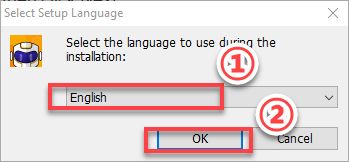
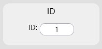
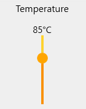

# 1. Bus Servo Controller User Manual

## 1.1 Introduction

The bus servo controller is an independently developed control device by Hiwonder. Its 10 key features provide an excellent user experience.

(1) Equipped with a high-performance STM32 microcontroller featuring an ARM Cortex-M3 core, enabling precise servo control with adjustable speed.

(2) Supports manual button programming — you can directly set servo angles without a host computer, making programming fast and easy.

(3) When used with Hiwonder PS2 controller and receiver, it allows remote control within a range of approximately 10 meters.

(4) Simple wiring — the controller only requires positive and negative power connections.

(5) Large 16M memory capacity, capable of storing up to 230 action groups, with each group supporting up to 510 actions.

(6) Low-voltage alarm function — when the positive voltage drops below 5.6V, the buzzer will sound an alarm.

(7) Built-in power switch for convenient use.

(8) Supports external expansion modules, such as an MP3 module or Bluetooth module.

(9) Supports online debugging without the need to install drivers.

(10) Supports serial communication, allowing the controller to communicate with other microcontrollers for intelligent robot control.

## 1.2 Interface and Power Supply Instructions

### 1.2.1 Interface Description

| **Interface/Button Name** | **Function** |
| :-----------------------: | :-----------: |
| USB Port | Connects the controller to a PC for communication. |
| Bluetooth Module / MP3 Module Port | Connects to an external Bluetooth module or MP3 module. |
| Servo Port | Controls bus servos. |
| Power Port | Connection port for lithium batteries. |
| Power Switch | Turns the controller power on or off. |
| Run Button | Press to run action group No. 100 in offline mode. |
| Program Button | Used to manually set action groups when servos are powered off. |
| PS2 Receiver Port | Connects to the receiver for PS2 controller communication. |
| Secondary Development Communication Port | Enables serial communication with other development platforms. |
| Buzzer Low-Voltage Alarm | Sounds an alarm when the voltage drops below 5.6 V. |
| LED Indicators | LED1: Power indicator, lights up when powered on.   LED2: Communication indicator, lights up when receiving signals. |

### 1.2.2 Power Supply Description

The power interface of the bus servo controller is shown below:

It supports a supply voltage between 6 V and 12 V and can be powered by a 7.4 V or 11.1 V lithium battery.

:::{Note}
* The supply voltage should match the servo voltage requirements. For low-voltage bus servos like LX-15D, LX-16A, use a 7.4 V battery. For high-voltage bus servos like LX-224HV, 824HV, use an 11.1 V battery.
* Before connecting the power wires to the controller, do not directly connect them to the lithium battery to avoid short circuits caused by contact between positive and negative terminals.
:::

7.4 V lithium battery power supply. Do not reverse the polarity.

11.1 V lithium battery power supply. Do not reverse the polarity.

## 1.3 PC Software Interface Overview

The servos and servo horns shown in this document are for demonstration only. Please refer to your actual hardware setup.

### 1.3.1 Setting Up the PC Software Control Environment

* **Hardware Wiring and Connections**

The required materials are listed in the table below. In this example, a high-voltage bus servo HTS-35H and an 11.1 V battery are required:

| **Name** | **Quantity** |
| :------------------------: | :------------: |
| Bus Servo Controller | 1 |
| HTS-35H Servo with cable | 1 |
| USB Data Cable | 1 |
| Battery Connection Cable | 1 |
| 11.1 V Lithium Battery | 1 |

(1) Connect the HTS-35H servo to any servo port on the bus servo controller.

(2) Connect the battery cable to the power port on the servo controller, and then connect the lithium battery. 

:::{Note}

Red wire to "+", black wire to "–". Do not reverse the polarity.

:::

(3) Connect the USB data cable between the servo controller and the PC, then turn on the controller power switch.

* **Software Environment Setup**

In the folder [Appendix->08 PC Software](Appendix.md), find and double-click [Bus Servo Control V3.4.exe](Appendix.md) to install the software.

Follow the installation steps below:

(1) Select the installation language **"English",** and click OK.

(2) Choose the installation path according to your PC's actual storage, then click Next.

(3) It is recommended to check "Create desktop shortcut," then click Next.

(4) Click Install.

(5) Uncheck **"Run Bus Servo Control,"** then click Finish to complete the installation.

### 1.3.2 PC Software Interface

(1) Double-click the desktop icon  to open the PC software.

(2) The bus servo controller software offers four modes:

① General Mode: Allows individual servo control, group control, action group editing, deviation adjustment, and more.

② Spider Mode: Allows single-servo control, action group editing, and playback for hexapod robots. This mode requires a hexapod robot and is not covered in detail here.

③ Human Mode: Allows single-servo control, action group editing, and playback for humanoid robots. This mode requires a humanoid robot and is not covered in detail here.

④ Servo Test: Allows setting servo IDs, reading status information, limiting rotation ranges, and other operations on individual servos.

* **General Mode Interface**

The interface is divided into six main areas:

① Language & Servo Selection Area

② Device Connection Area

③ Servo Control Area

④ Action Group Detail List

⑤ Action Group Settings Area

⑥ Deviation Settings Area

(1) Language & Servo Selection Area

This area allows you to select the interface display language and specify the connected servos.

| Icon | Function |
| :--: | :------: |
|  | Click the drop-down button to select the interface language.  |
|  | **Servo selection area**, where all servos are checked by default. During use, uncheck servos that are not connected and only keep the ones that are actually connected.  |
|  | Click to **uncheck** the currently selected servo. |
|  | Click to **reset** the currently selected servo, moving it to position **500**. |

(2) Device Connection Area

This area is used to connect the servo controller and check its connection status.

| Icon |                                                                                                                                                                                                                                                         Function                                                                                                                                                                                                                                                          |
| :--: |:-------------------------------------------------------------------------------------------------------------------------------------------------------------------------------------------------------------------------------------------------------------------------------------------------------------------------------------------------------------------------------------------------------------------------------------------------------------------------------------------------------------------------:|
|  |                                                                                                                                                                                                     Connection status button. When the controller is connected to the PC via USB data cable, the button turns green.                                                                                                                                                                                                      |
|  | **Wireless Connection Instructions:** - Refer to section [1.4.4 Wireless Debugging](#anchor_1_4_4) - **COM:** Connection port for wireless Bluetooth module (avoid `COM1`) - **Baud Rate:** Must be set to `9600` for Bluetooth (not `115200`) - **Wireless Connection**: This is the wireless connection status button. When the controller is connected to the wireless Bluetooth debugging module, this button will turn green.  |

(3) Servo Control Area

You can adjust the servo positions by changing the corresponding values as shown below.

| Icon | Function |
| :--: | :--: |
|  | Indicates the port number to which the servo is connected. |
|  | Used to adjust the servo position. Value range: 0–1000, corresponding to an angle range of 0°–240°. |
|  | Note:The small slider below the icon is used to adjust the servo deviation, ranging from –100 to 100. To prevent accidental operations, you must click the **Read** button before you can move the deviation adjustment slider. |

(4) Action Group Detail List

In this area, you can view the action execution time and servo parameters.

| Icon | Function |
| :--: | :--: |
|  | Run the currently selected action. |
|  | The ID number of the action. |
|  | The duration required to execute the action. Measured in milliseconds (ms). |
|  | Lists parameters for each servo. |
|  | Example: `#1` refers to servo ID 1, and `P500` refers to a position value for ID 1. |

(5) Action Group Settings Area

This area allows you to run, open, add, delete, modify, and view action groups and action group files.

| Icon | Function |
| :--: | :--: |
|  | Click the drop-down button on the right to select an existing action group. |
|  | Download the action group from the action detail list to the servo controller in the currently selected group number. |
|  | Delete the currently selected action group file which cannot be recovered. |
|  |**Caution!** Delete all action group files which cannot be recovered.|
|  | Execute the selected action group once. |
|  | Stop the currently running action group. |
|  | Combine the current servo values in the Servo Control Area into an action and add it to the last row of the action detail list. |
|  | Delete the selected action from the action detail list. |
|  | Replace the servo parameters of the currently selected action in the list with the values from the Servo Control Area. The action time will be updated to the value set in **"Duration."** |
|  | Insert a new action group above the selected action group. |
|  | Set the duration for a single action. You can modify the value in the input box. Measured in milliseconds (ms). |
|  | Execute a single action from the action detail list once. If **"Loop"** is checked, the action will be executed repeatedly. |
|  | Open a specified action group file. |
|  | Combine the actions in the action detail list into an action group file and save it to a specified location. |
|  | When the action detail list is not empty, click this button to append a specified action group to the end of the list. |

(6) Deviation Settings Area

In this area, you can adjust the servo deviation. For detailed adjustment instructions, please refer to the later section.

| Icon | Function |
| :--: | :--: |
|  | Reset all servo parameters in the Servo Control Area to 500. |
|  | Read the current deviation value of the servo. |
|  | Save the adjusted servo deviation values to the controller. |
|  | Reset the servo deviation values to 0. |

* **Servo Debugging Tool Interface**

The interface is divided into four main areas: 

① Language & Controller Connection Status Area, 

② Parameter Settings Area, 

③ Servo Status Display Area, 

④ Action Group Download & Debugging Area.

(1) Language & Controller Connection Status Area

In this area, you can switch the interface language and check the connection status between the PC software and the bus servo controller.

| Icon | Function |
| :--: | :--: |
|  | Click the drop-down button to select the interface language.  |
|  | Wired connection status button. When the controller is connected to the PC, this button turns green.  |

(2) Parameter Settings Area

In this area, you can configure servo parameters and limits.

| Icon | Function |
| :--: | :--: |
|  | Displays the current servo ID. Click  to display the current servo ID in the white box. Click  to replace the servo ID with the ID entered in the box. |
|  | Displays the servo deviation value. |
|  | LED control switch. For servos with built-in LEDs, use this button to turn the LED on or off. |
|  | Set LED blinking alarm. When over-temperature alarm is enabled and the servo temperature exceeds the set range, the LED will blink to indicate an alarm. Over-voltage alarm is triggered when the servo voltage exceeds the set range. Stall alarm is triggered when the servo is stalled. |
|  | Set the servo rotation range. The servo will not rotate beyond the specified upper and lower limits. The first slider sets the upper rotation limit. The second slider sets the lower rotation limit. |
|  | Set the servo voltage range. If the voltage exceeds the upper or lower limit and the over-voltage alarm is enabled, the LED will indicate an alarm. The left slider sets the lower voltage limit. The right slider sets the upper voltage limit. |
|  | Set the maximum servo temperature range. If the temperature exceeds the set value and the over-temperature alarm is enabled, the LED will indicate an alarm. |
|  | Read current servo parameters, including ID, temperature, current position, etc. |
|  | Save the modified parameter settings to the servo. |
|  | Restore parameter settings to default values. |

(3) Servo Status Display Area

This area displays the current status information of the servo.

| Icon | Function |
| :--: | :--: |
|  | Displays the current servo voltage. |
|  | Displays the current servo temperature. |
|  | Displays the current servo position. |

(4) Action Group Download & Debugging Area

In this area, you can batch download action group files and switch the servo mode to motor mode.

| Icon | Function |
| :--: | :--: |
|  | Open multiple action group files using this button . The opened files will be shown in the white box below the group numbers. Download the action group files sequentially using this button . |
|  | **Servo Mode:**You can set the target position and execution time of the servo. |
|  | **Motor Mode:**You can set the rotation speed of the servo. If the value is positive, the servo rotates clockwise. If negative, it rotates counterclockwise. The larger the absolute value, the faster the rotation speed in that direction. |

## 1.4 PC Debugging

### 1.4.1 Install Serial Port Driver

:::{Note}

* Before using the PC software, please make sure that the `CH341` serial port driver is installed on your PC. Otherwise, the software may not connect properly.

* If the `CH341` driver is already installed, you can skip this step.
  :::

(1) Locate the [ch341ser.exe](Appendix.md) driver installation file in the [Appendix->PC software Package](Appendix.md) folder in this section. Double-click to open the file.

(2) Click the **Install** button. Once clicked, both the **Install** and **Uninstall** buttons will become grayed out. Wait for a moment until you see a message indicating that the installation was successful.

### 1.4.2 Servo Status

There are two methods for PC debugging: wired debugging and wireless debugging. The following sections provide a brief introduction to both methods.

In this example, we will use the servo with ID 1 for demonstration. The process is the same for servos with other IDs.

The following three diagrams show the servo's three basic positions: central position, minimum angle, and maximum angle. For better visualization, a servo horn is used in the illustrations with the label placed on the right side of the horn as the initial reference position.

Let's take a 240° range servo as an example to demonstrate the relationship between position values and angles.

At the central position, which corresponds to 500, the corresponding angle is 120°. At the minimum position, 0, the corresponding angle is 0°, and at the maximum position, 1000, the corresponding angle is 240°.

For this servo, the rotation angle after power-on is 240°. So, the calculation method for servo angle and position is: `240/1000 = 0.24`.

For example, if you need the servo to rotate to 90°, the corresponding position calculation is `90/0.24 = 375`.

Central position:servo angle 120° (position500).

Minimum position: servo angle 0° (position 0)

Maximum position: servo angle 240° (position 1000)

### 1.4.3 Wired Debugging

For wired debugging, connect the servo controller to your computer using a USB data cable.

(1) Connect the servo controller and the servo to the PC software, then select Servo ID 1. You can select the actual servo you need to control.

(2) Click **"Reset Servo"** to move the servo to its central position. Then, the servo will be at 120°. 

:::{Note}

After powering on, the servo will not automatically move to the central position. If you operate the servo directly without centering it first, it may cause damage.

:::

(3) Drag the slider below the servo ID to move it and check its positions at 240° and 0°.

<table class="docutils-nobg" border="0" style="border: none;">
<tr>
<td style="text-align: center;border: none;"></td>
<td style="text-align: center;border: none;"></td>
</tr>
<tr>
<td style="text-align: center;border: none;"></td>
<td style="text-align: center;border: none;"></td>
</tr>
<tr>
<td style="text-align: center;border: none;">Servo angle 240° (position 1000)</td>
<td style="text-align: center;border: none;">Servo angle 0° (position 0)</td>
</tr>
</table>

### 1.4.4 Wireless Debugging

:::{Note}
The wireless Bluetooth debugging module needs to be purchased separately, please contact customer support.
:::

Wireless Bluetooth debugging allows you to control the servo wirelessly by connecting the Bluetooth debugging module to the bus servo controller and then connecting the module to the PC software.

* **Connection Steps**

(1) Connect the servo to the controller and turn on the controller. Important: Turn on the controller before connecting the Bluetooth debugging module.

(2) Connect the Bluetooth debugging module to the computer using a USB data cable. The two LEDs on the Bluetooth module will flash blue. Once connected, the blue LED on the controller board will stay solid.

(3) If the LEDs continue to flash after 50 seconds, press the **"DEL"** button on the Bluetooth module to clear previous device information and re-search for a new connection.

(4) Wait for the Bluetooth connection. Once the LED on the Bluetooth module stays solid, the connection is successful.

(5) Open the PC software and select the corresponding `COM` port. Do not select `COM1`, as it is reserved for system communication. Then set the baud rate to `9600`. If set to `115200`, the servo cannot be controlled, and the buzzer will beep to indicate an error. Next, click **"Connect wireless"**. When the status button turns green, the connection is successful.

(6) Select servo ID 1, and you can select the actual servo you want to control.

(7) You can then follow the same debugging steps described in the Wired Debugging section.

## 1.5 Action Group Editing and Execution

### 1.5.1 Action Group Editing

In this section, servo ID 1 is taken as an example to create an action group that moves the servo left and right.

(1) Connect the servo to the PC software and select servo ID 1. You can select the actual servo you want to control.

(2) Click **"Reset servo"** to move the servo to the central position.

(3) Set the duration to 1000 ms, then click **"Add action"** to add this action to the action list.

(4) Next, rotate the servo to the right, set the duration to 1000 ms, and click **"Add action"** to add to the action list.

(5) To make the transitions between actions smoother, you can insert a transition action between the two movements. Keep the servo value unchanged, set the duration which usually between 100–300 ms, then click **"Add action"** again.

(6) Reset the servo to its central position, set the time to 1000 ms, and click **"Add action"**.

(7) Add a transition action by setting the time to 200 ms, and click **"Add action"**.

(8) Set the servo rotating to the left, set the time to 1000 ms, and click **"Add action"**.

(9) Add another transition action, set the time to 200 ms, and click **"Add action"**.

(10) Last step, reset the servo to its central position, set the time to 1000 ms, and click **"Add action"**.

(11) After completing the action editing, click **"Save action file"** to save the edited action group file to your local computer. Note: You can customize the save path. For easier future use, it is recommended to name the file using a combination of numbers and a descriptive name, for example, `10_LeftRightMove`. Later, you can call this action group simply by entering the group number 10.

### 1.5.2 Action Group Execution

After saving an action group, you can run it again either by clicking the **"Run online"** button directly or by using the **"Run action"** button in the action list. The steps to execute an action group are as follows:

(1) Connect the servo to the PC software.

(2) In the action group drop-down list, select an action group number.
Group 10 is taken as an example in this section, and you can choose any group as needed. Note: Group 100 is reserved for offline control. When using offline functionality, you can download an action group to Group 100.

(3) After selecting the action group number, click **"Download"** to download the actions in the action detail list to the selected action group number. You will hear a short **"beep"** from the buzzer, and a pop-up message will confirm that the download is complete.

(4) Now, click **"Run action"** to execute the new action group 10.

## 1.6 Servo Deviation Adjustment

Since the servo shaft connects to the servo horn or disk through gear engagement, it might not be possible to install the horn or disk at an exact desired position during assembly. In such cases, you can use the PC software to fine-tune the servo deviation, allowing you to adjust the servo to a precise target position.

Here, we will demonstrate adjusting Servo ID 1 to a 120° position as an example.

### 1.6.1 Getting Started

Connect the servo controller and the servo to the PC software, then select Servo ID 1. You can select the actual servo you need to control.

### 1.6.2 Determining the Deviation Condition

(1) After resetting the servo to central position, if it appears as shown in the figure below, no deviation adjustment is needed.

(2) If the angle between the servo horn and the servo's horizontal plane is less than 13°, and it can be corrected using the PC software, this is considered a minor deviation. You can adjust it following the instructions in the Minor Deviation Adjustment section later. Example of a minor deviation condition:

(3) If the angle between the servo horn and the servo's horizontal plane is greater than 13°, and it cannot be corrected using the PC software, this is considered a major deviation. You can adjust it following the instructions in the Major Deviation Adjustment section later. Example of a major deviation condition:

### 1.6.3 Minor Deviation Adjustment

Minor offsets can be directly corrected using the deviation slider in the PC software interface.

:::{Note}
The adjustable range is from -100 to 100. If you can align the servo horn parallel to the horizontal plane within this range, it is considered a minor deviation. If the required adjustment exceeds this range, it is considered a major deviation, and you should follow the Major Deviation Adjustment instructions.
:::

(1) Connect the servo controller and the servo to the PC software, then select Servo ID 1. You can select the actual servo you need to control.

(2) Click **"Reset servo"** to move the servo to the central position.

(3) Click **"Read"** button in the Deviation setting area to read the current deviation value of the selected servo port on the controller.

(4) Drag the small slider below servo ID 1 to adjust the horn so that it is parallel to the horizontal plane of the servo.

(5) After making adjustments, click **"Download"** in the Deviation setting area to save the deviation value to the controller. **Important: If you do not download, the adjustment will not take effect.**

### 1.6.4 Major Deviation Adjustment

For major deviations, you need to remove the servo horn from the servo shaft first. After resetting the servo to central position, you can repeat the steps from Minor Deviation Adjustment.

(1) Remove the shaft screw and then pull off the servo horn.

(2) Power on the servo controller and click **"Reset servo"**.

(3) Once centering is complete, power off the controller. Reinstall the servo horn so that it is parallel to the horizontal plane of the servo, then tighten the shaft screw.

(4) Power on the controller again and refer to section 6.3 Minor Deviation Adjustment to fine-tune the servo if needed.

## 1.7 Using the Offline Button

### 1.7.1 Run Action Group Offline

In addition to running action groups online, the bus servo controller also supports offline control using the onboard **"Run"** button. **"10_LeftRightMove"** from section 5 Action Group Editing and Execution is taken as an example in this section.

Detailed steps are as follows:

(1) Connect the servo controller board and servo to the PC software.

(2) Click **"Open action file"**, navigate to the save location, and open the [10_LeftRightMove](Appendix.md) action file.

(3) Select **"Action group"** No. 100, then click **"Download"**. You will hear a **"beep"** from the buzzer, indicating a successful download.

(4) Press the **"Run"** button on the controller to run the action group offline.

### 1.7.2 Manually Editing Action Group Offline

The bus servo controller features two action editing buttons. Without connecting to any external devices, such as a PC or smartphone, you can manually adjust servo positions and edit action groups offline using these buttons.

* **Program Button**

(1) Press and hold the `Program` button on the bus servo controller for about 3 seconds. The controller will beep once, and `LED2` will change from solid on to flashing, indicating that it has entered manual editing mode. When powering off, you can manually move the servo into different positions.

(2) After positioning the servo for each action, press the `Program` button briefly once. `LED2` will flash several times, followed by a beep from the buzzer, indicating that the action has been saved.

(3) When all actions are finished, press and hold the `Program` button again. `LED2` will switch from flashing back to solid on, and the buzzer will beep once, indicating that you have exited programming mode.

* **Run Button**

(1) Press the `Run` button briefly to execute the newly created action once.

(2) To repeat the action continuously, press and hold the `Run` button for 3 seconds. To stop continuous operation and return to single-run mode, press the `Run` button briefly again.

## 1.8 Wireless Controller Control

### 1.8.1 Getting Started

The following components are needed for wireless controller control:

| **Name** | **Quantity** |
| :-------------------------------------------: | :------------: |
| Bus Servo Controller | 1 |
| HTS-35H Servo with cable | 1 |
| Battery Connection Cable | 1 |
| 11.1 V Lithium Battery | 1 |
| PS2 controller (requires two AAA batteries) | 1 |
| PS2 Receiver | 1 |

(1) Remove the back cover of the wireless controller and insert two AAA batteries. Make sure to insert the batteries with the correct polarity.

(2) Connect the HTS-35H servo to any servo port on the bus servo controller.

(3) Connect the PS2 receiver to the controller.

### 1.8.2 Device Connection

(1) Turn on the controller switch.

(2) Turn on the controller. The red and green LED indicators on the controller will begin flashing simultaneously.

(3) Wait a few seconds. The bus servo controller and PS2 controller will automatically pair. Once pairing is successful, the red and green LEDs will remain solid. If only one LED (either red or green) stays on after powering up, press the `MODE` button.

(4) If the connection fails, turn off both the robotic arm and the PS2 controller. Then repeat the steps above.

:::{Note}
If the `PS2` controller is not connected to the robotic arm within 30 seconds after being powered on, or if there is no user input for 5 minutes after connection, the `PS2` controller will enter sleep mode. To wake the `PS2` controller, simply press the **"START"** button.
:::

### 1.8.3 Modes

There are two modes for controlling the servos with the PS2 controller: Action Group Mode and Single Servo Mode. After a successful connection, the default mode is Action Group Mode.

**Single Servo Mode:** Use the `PS2` controller buttons to control a single servo, allowing it to rotate forward or backward.

**Action Group Mode:** Use the `PS2` controller buttons to run specific action groups.

**Switching Between Modes:** To switch between modes, press both `SELECT` and `START` buttons. A sound prompt indicates the switch was successful. Switching from Single Servo Mode to Action Group Mode: one beep. Switching from Action Group Mode to Single Servo Mode: two beeps.

### 1.8.4 Button Descriptions

* **Buttons in Single Servo Mode**

The button functions when in Single Servo Mode:

Press the **START** button to return the servo to the central position.

:::{Note}
After the servo reaches its limit position, please rotate it in the opposite direction. Continuing to push in the same direction may cause the servo to stall or become damaged.
:::

* **Buttons in Action Group Mode**

The button functions when in Action Group Mode:

For combo button presses, hold `SELECT` first, then press the corresponding button.

| **Button** | **Function** |
| :--------: | :----------: |
| START | Run action group 0 |
| ↑ | Run action group 1 once |
| ↓ | Run action group 2 once |
| ← | Run action group 3 once |
| → | Run action group 4 once |
| △ | Run action group 5 once |
| × | Run action group 6 once |
| ◻ | Run action group 7 once |
| ○ | Run action group 8 once |
| L1 | Run action group 9 once |
| R1 | Run action group 10 once |
| L2 | Run action group 11 once |
| R2 | Run action group 12 once |
| SELECT+△ | Run action group 13 once |
| SELECT+× | Run action group 14 once |
| SELECT+◻ | Run action group 15 once |
| SELECT+○ | Run action group 16 once |
| SELECT+L1 | Run action group 17 once |
| SELECT+R1 | Run action group 18 once |
| SELECT+L2 | Run action group 19 once |
| SELECT+R2 | Run action group 20 once |

## 1.9 APP Control

### 1.9.1 APP Installation

iOS users: Search for [ServoControl](https://apps.apple.com/us/app/servocontrol/id6473884994) in the **App Store** and download directly.

Android users: Locate the [ServoControl-V1.0.0.apk](Appendix.md) APK file in the provided resource package and install it manually on your phone.

### 1.9.2 Device Connection

:::{Note}

* Ensure that both `Bluetooth` and `Location Services` are enabled in your phone's settings before launching the app.

* Do not pair the device manually via system Bluetooth settings. Instead, use the `Bluetooth` button within the app to initiate pairing and connection.

* System requirements: Android 7.0 or above, iOS 9.1 or above.

* This section uses the Android app as an example, following the same steps for the iOS version.
:::

(1) Turn on the controller switch.

(2) Open the app on your phone, and select **"BUS Servo"** on the interface.

(3) There are two servo control modes: **Global Mode** and **Single Mode**. Global Mode enables controlling multiple servos and editting action groups. While Single Mode allows control of a single servo and supports angle feedback. Both modes connect the same way, and the Global Mode is taken as an example in this section.

(4) When not connected, the icon  in the top right corner will blink. Select `Hiwonder` to connect. If **"Hiwonder"** does not appear, try refreshing the search or power cycling the bus servo controller.

(5) Once connected, the Bluetooth icon in the top left will stay solid white, and the center of the screen will show a Bluetooth Connected message.

### 1.9.3 Button Function

* **Global Mode Interface and Icon Functions**

| Icon | Function |
| :--: | :--: |
|  | Set the rotation position of a specific servo. You can scroll down the list to control more servos. |
|  | Call action group files that have already been downloaded to the bus servo controller. |
|  | Reset all servos to their central positions. |

* **Single Mode Interface and Icon Functions**

| Icon | Function |
| :--: | :--: |
|  | Select the servo ID number. |
|  | Control the rotation position of the selected servo. |
|  | Read the current angle position of the servo. |
|  | Power off the servo. |
|  | Call action group files that have already been downloaded to the bus servo controller. |
|  | Reset all servos to their central positions. |

## 1.10 Specifications

<table class="docutils-nobg" border="0" >
      <tr>
          <td><strong>Item</strong></td>
          <td colspan="2">Bus Servo Controller</td>
      </tr>
      <tr>
          <td rowspan="2">Dimensions</td>
          <td>Footprint (L × W)</td>
          <td>58mm*42mm</td>
      </tr>
      <tr>
          <td>Mounting Hole Distance (L × W)</td>
          <td>49mm*34mm</td>
      </tr>
      <tr>
          <td rowspan="2">Power Supply</td>
          <td>Lithium Battery</td>
          <td rowspan="2">6V-12V</td>
      </tr>
      <tr>
          <td>Adapter</td>
      </tr>
      <tr>
          <td rowspan="4">Control Methods</td>
          <td>PC Software</td>
          <td>Supported</td>
      </tr>
      <tr>
          <td>Wireless Controller</td>
          <td>Supported</td>
      </tr>
      <tr>
          <td>Bluetooth</td>
          <td>Supported</td>
      </tr>
      <tr>
          <td>Offline Control</td>
          <td>Supported</td>
      </tr>
      <tr>
          <td rowspan="2">Programming Methods</td>
          <td>PC Software</td>
          <td>Supported</td>
      </tr>
      <tr>
          <td>Manual Button</td>
          <td>Supported</td>
      </tr>
      <tr>
          <td rowspan="2">Communication</td>
          <td>Serial Communication</td>
          <td>Refer to protocol documentation</td>
      </tr>
      <tr>
          <td>Baud Rate</td>
          <td>9600</td>
      </tr>
      <tr>
          <td rowspan="7">Other Specifications</td>
          <td>Memory Size</td>
          <td>16M</td>
      </tr>
      <tr>
          <td>Built-in Power Switch</td>
          <td>Supported</td>
      </tr>
      <tr>
          <td>External MCU Support</td>
          <td>Supported</td>
      </tr>
      <tr>
          <td>External MP3/Bluetooth Module Support</td>
          <td>Supported</td>
      </tr>
      <tr>
          <td>Driver-Free on PC</td>
          <td>Supported</td>
      </tr>
      <tr>
          <td>Servo Angle Feedback</td>
          <td>Supported</td>
      </tr>
</table>