# 2. Bus Servo Controller Secondary Development

## 2.1 Bus Servo Controller Communication Protocol

**Serial communication, baud rate: 9600**

**Command packet data type: Hexadecimal**

Command Packet Format:

| Frame Header | Data Length | Command | Parameters |
|:------------:|:-----------:|:-------:|:-----------:|
| 0x55 0x55 | Length | Cmd | Prm 1…Prm N |

Frame Header: Two consecutive 0x55 bytes indicate the start of a data packet.

Data Length: The total length of the packet, calculated as the number of parameters (N) plus 2 bytes, 1 byte for the command and 1 byte for the length itself. The data length formula is Length = N + 2.

Command: Various control commands.

Parameters: Additional control information required by the command.

### 2.1.1 User-Initiated Data Transmission to the Controller

The user's transmission data pin should be connected to the controller's RX pin. Additionally, the user's control system must share a common ground (GND) with the controller. If the data sent is incorrect, the blue `LED2` will remain steadily lit without blinking, and the buzzer will sound twice (**"beep beep"**) to alert the user of the data transmission error.

(1) Command Name: **CMD_SERVO_MOVE**

Description: Controls the movement of any number of servos.

| Frame Header | Data Length | Command | Parameters |
|--------------|-------------|---------|------------|
| 0x55 0x55 | Number of servos * 3 + 5 | 3 | Prm 1…Prm N |

Parameter 1: Number of servos to control

Parameter 2: Time low byte

Parameter 3: Time high byte

Parameter 4: Servo ID

Parameter 5: Angle position low byte

Parameter 6: Angle position high byte

Subsequent parameters: Same format as parameters 4, 5, and 6, for controlling additional servos' positions. Example:

① Control servo 1 to move to position 800 within 1000 ms:

| 0x55 0x55 | 0x08 | 0x03 | 0x01 0xE8 0x03 0x01 0x20 0x03 |
|-----------|------|------|-------------------------------|

② Control servos 2 and 9 to move to position 800 within 800 ms:

| 0x55 0x55 | 0x0B | 0x03 | 0x02 0x20 0x03 0x02 0x20 0x03 0x09 0x20 0x03 |
|-----------|------|------|----------------------------------------------|

(2) Command Name: **CMD_ACTION_GROUP_RUN**

Description: Controls the execution of an action group. Note that the action group must already be downloaded to the controller. You can set the number of times the action group runs. If you want it to run continuously, set the repeat count parameter to 0, which means infinite loops.

| Frame Header | Data Length | Command | Parameters |
|:------------:|:-----------:|:-------:|:-----------------:|
| 0x55 0x55 | 5 | 6 | Prm 1 Prm 2 Prm 3 |

Parameter 1: The ID number of the action group to run.

Parameter 2: Lower 8 bits of the repeat count.

Parameter 3: Upper 8 bits of the repeat count.

Examples:

① Run action group 8 once:

| 0x55 0x55 | 0x05 | 0x06 | 0x08 0x01 0x00 |
|-----------|------|------|----------------|

② Run action group 2 infinitely:

| 0x55 0x55 | 0x05 | 0x06 | 0x02 0x00 0x00 |
|-----------|------|------|----------------|

(3) Command name: **CMD_ACTION_GROUP_STOP**

Description: Stop the currently running action group. If no action group is running, sending this command has no effect.

| Frame Header | Data Length | Command | Parameters |
|:------------:|:-----------:|:-------:|:----------:|
| 0x55 0x55 | 2 | 7 | None |

Examples:

Stop the currently running action group:

| 0x55 0x55 | 0x02 | 0x07 |
|-----------|------|------|

(4) Command name: **CMD_ACTION_GROUP_SPEED**

Description: Controls the speed of the action group, expressed as a percentage. For example, to set the speed of action group 1 to twice the original speed, set the percentage value to 200, meaning 200%. If the action group number is 0xFF, it means adjusting the speed of all downloaded action groups.

:::{Note}
*   The adjusted speed parameter is not saved after power-off. Each time the device is powered on, the action groups will run at the default speed. If you need to adjust the speed, you must resend this command.
*   Servos have their own maximum speed limits. If the set speed exceeds the servo's maximum speed, the adjustment will not take effect.
:::

| Frame Header | Data Length | Command | Parameters |
|:------------:|:-----------:|:-------:|:-----------------:|
| 0x55 0x55 | 5 | 11 | Prm 1 Prm 2 Prm 3 |

Parameter 1: Action group number to be adjusted

Parameter 2: Lower 8 bits of the speed percentage

Parameter 3: Higher 8 bits of the speed percentage

Examples:

① To set action group 8 to run at 50% speed:

| 0x55 0x55 | 0x05 | 0x0B | 0x08 0x32 0x00 |
|-----------|------|------|----------------|

② To set all downloaded action groups to run at 300% speed (3× original speed):

| 0x55 0x55 | 0x05 | 0x0B | 0xFF 0x2C 0x01 |
|-----------|------|------|----------------|

(5) Command name: **CMD_GET_BATTERY_VOLTAGE**

Description: Get the battery voltage of the controller, in millivolts (mV). After this command is sent, the controller will immediately return a data packet containing two parameters.

| Frame Header | Data Length | Command | Parameters |
|:------------:|:-----------:|:-------:|:----------:|
| 0x55 0x55 | 2 | 15 | None |

Returned data packet from the controller:

| Frame Header | Data Length | Command | Parameters |
|:------------:|:-----------:|:-------:|:-----------:|
| 0x55 0x55 | 4 | 15 | Prm 1 Prm 2 |

Parameter 1: Lower 8 bits of the voltage value

Parameter 2: Higher 8 bits of the voltage value

Example: Get the controller's battery voltage:

| 0x55 0x55 | 0x02 | 0x0F |
|-----------|------|------|

If the returned voltage value is 7500 mV:

| 0x55 0x55 | 0x04 | 0x0F | 0x4C 0x1D |
|-----------|------|------|-----------|

(6) Command name: **CMD_MULT_SERVO_UNLOAD**

Description: Used to power off multiple servos. Once this command is sent, the specified servos will lose holding torque and can be freely rotated by hand.

| Frame Header | Data Length | Command | Parameters |
|:------------:|:-------------------------------:|:-------:|:-----------:|
| 0x55 0x55 | Number of servos to control + 3 | 20 | Prm 1…Prm N |

Parameter 1: Number of servos to control

Parameter 2: ID of servo a

Parameter 3: ID of servo b

Parameter ...: ID of servo x

Example:

① Unload servos with IDs 1, 2, and 3.

| 0x55 0x55 | 0x06 | 0x14 | 0x03 0x01 0x02 0x03 |
|-----------|------|------|---------------------|

② Unload servos with IDs 1, 2, 3, 4, 5, and 6.

| 0x55 0x55 | 0x09 | 0x14 | 0x06 0x01 0x02 0x03 0x04 0x05 0x06 |
|-----------|------|------|------------------------------------|

(7) Command name: **CMD_MULT_SERVO_POS_READ**

Description: Reads the angle position values of multiple servos.

| Frame Header | Data Length | Command | Parameters |
|:------------:|:-------------------------------:|:-------:|:-----------:|
| 0x55 0x55 | Number of servos to control + 3 | 21 | Prm 1…Prm N |

Parameter 1: Number of servos to read

Parameter 2: ID of servo a

Parameter 3: ID of servo b

Returned data packet from the controller:

| Frame Header | Data Length | Command | Parameters |
|:------------:|:-------------------------------:|:-------:|:-----------:|
| 0x55 0x55 | Number of servos to read*3 + 3 | 21 | Prm 1…Prm N |

Parameter 1: Number of servos to read

Parameter 2: Servo ID

Parameter 3: Angle position low byte

Parameter 4: Angle position high byte

Parameters ...: The format is the same as Parameters 2, 3, and 4, and is used to read the angle position of different servo IDs.

Examples:

Read the angle positions of servos with IDs 1, 2, 3, 4, 5, and 6:

| 0x55 0x55 | 0x09 | 0x15 | 0x06 0x01 0x02 0x03 0x04 0x05 0x06 |
|-----------|------|------|------------------------------------|

For example, if all returned angle position values are 500:

| 0x55 0x55 | 0x15 | 0x15 | 0x06 0x01 0xF4 0x01 0x02 0xF4 0x01 0x03 0xF4 0x01 0x04 0xF4 0x01 0x05 0xF4 0x01 0x06 0xF4 0x01 |
|----|----|----|----|

### 2.1.2 Data Sent by the Controller

During operation, when the controller's status changes, it will actively send data to the user via the serial port. For example, when an action group finishes running. There are multiple ways to operate the controller, such as using a PS2 controller, connecting via a Bluetooth module, or using the user's custom serial interface. Hence, it is necessary for different control methods to be aware of the current status of the controller to facilitate proper management and operation. The following are the instructions that the controller returns to the user.

(1) Command name: **CMD_ACTION_GROUP_RUN**

Description: When the user sends a data packet to start running an action group, at the moment the action group starts running, the controller returns a data packet. The data format is exactly the same as the data packet sent by the user.

| Frame Header | Data Length | Command | Parameters |
|:------------:|:-----------:|:-------:|:-----------------:|
| 0x55 0x55 | 5 | 6 | Prm 1 Prm 2 Prm 3 |

Parameter 1: The action group ID to be run.

Parameter 2: Low byte of the number of times to run the action group.

Parameter 3: High byte of the number of times to run the action group.

Example:

When action group 8 is running and is set to run once, the controller returns the following data packet to the user:

| 0x55 0x55 | 0x05 | 0x06 | 0x08 0x01 0x00 |
|-----------|------|------|----------------|

(2) Command name: **CMD_ACTION_GROUP_STOP**

Description: When a running action group is forcibly stopped by another method, for example, via the gamepad or by the user sending a stop command, this command is returned. The data packet format is the same as the one sent by the user when actively sending a stop command.

| Frame Header | Data Length | Command | Parameters |
|--------------|-------------|---------|------------|
| 0x55 0x55 | 2 | 7 | None |

Examples:

When an action group that is currently running is forcibly stopped, the following data is returned:

| 0x55 0x55 | 0x02 | 0x07 |
|-----------|------|------|

(3) Command name: **CMD_ACTION_GROUP_COMPLETE**

Description: When an action group finishes running naturally, not forcibly stopped, but completes on its own, this command is returned.

| Frame Header | Data Length | Command | Parameters |
|:------------:|:-----------:|:-------:|:-----------------:|
| 0x55 0x55 | 5 | 8 | Prm 1 Prm 2 Prm 3 |

Parameter 1: The action group ID to be run.

Parameter 2: Low byte of the number of times to run the action group.

Parameter 3: High byte of the number of times to run the action group.

Example:

When action group No. 8 is set to run once and finishes naturally, the controller returns the following data to the user:

| 0x55 0x55 | 0x05 | 0x08 | 0x08 0x01 0x00 |
|-----------|------|------|----------------|

## 2.2 Arduino Development

### 2.2.1 Getting Started

* **Wiring Instruction**

This example uses an Arduino development board and a bus servo controller, powered by a 7.4V 6000mAh lithium battery, or **an 11.1V battery for high-voltage servos**. Connect the serial port of the bus servo controller to the serial port of the open-source servo controller.

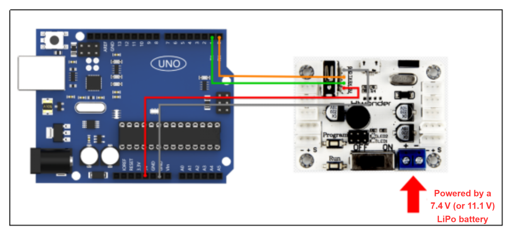

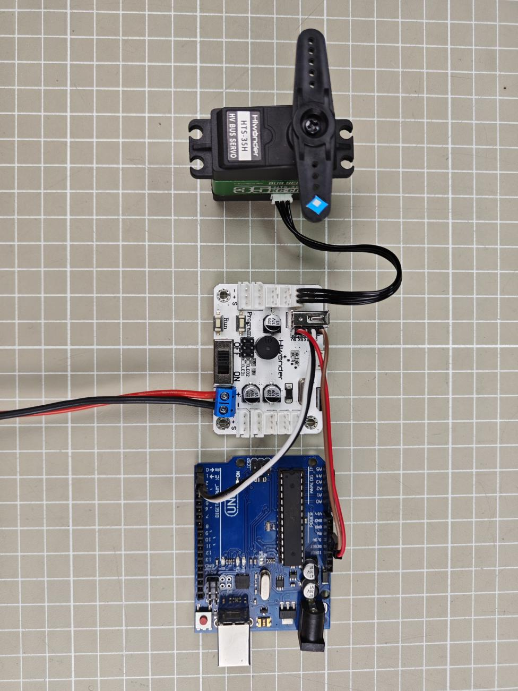

:::{Note}
*   When using **Hiwonder's** lithium battery, connect the battery cable with the red wire to the positive (+) terminal and the black wire to the negative (–) terminal of the DC port.
*   Before connecting the battery cables, make sure they are not already attached to the lithium battery. This prevents the risk of a short circuit caused by accidental contact between the positive and negative wires.
*   When connecting the serial ports, make sure to cross the RX and TX pins. As shown in the two diagrams above.
:::

* **Environment Configuration**

Install Arduino software on PC. The software package and installation instruction are stored in [Appendix -> Arduino Installation Package](Appendix.md).

### 2.2.2 Development Case

**Case 1 Control a Single Servo**

In this example, the serial port is used to send instructions to the bus servo controller, which then controls the servo to move.

* **Run Program**

[Source Code](../_static/source_code/Arduino_Development.zip)

(1) Open the **LobotServoController.ino** program located at:  

[Case 1 Control a Single Servo\LobotServoController](../_static/source_code/Arduino_Development.zip).

(2) After opening the program, go to **Sketch** → **Include Library** → **Add .ZIP Library**, and select the **LobotServoController.zip** file located in the same path to add it. If adding the library fails, please refer to the Arduino IDE user manual.
[2.Bus_Servo_Controller_Secondary_Development.md](2.Bus_Servo_Controller_Secondary_Development.md)
(3) Connect the Arduino controller to your computer via a USB cable. In the toolbar, set the board type to **Arduino UNO**, and select the correct port.

:::{Note}
The port number is not fixed. The **Arduino IDE** will display the board model next to the corresponding port number.
:::

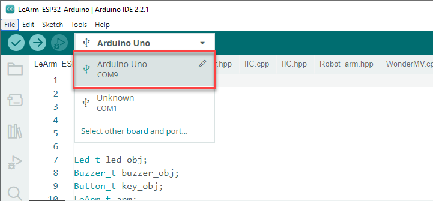

(4) After connecting, click the icon  to upload. Once the upload is complete, turn on the bus servo controller's power switch, and Servo ID 1 will start moving.

:::{Note}
If you see an upload failure message, try disconnecting the bus servo controller from the Arduino board before uploading. After the upload completes, reconnect it to the Arduino.
:::

* **Project Outcome**

After running the program, the servo will continuously swing back and forth between position 0 and position 1000, with a 1.5-second interval.

* **Program Brief Analysis**

[Source Code](../_static/source_code/Arduino_Development.zip)

(1) Import Necessary Libraries

{lineno-start=1}

```python
#include <LobotServoController.h>
```

The library includes the necessary modules for communicating with the bus servo controller. You can use the predefined variables and functions in it to control the servo.

(2) UART Initialization

{lineno-start=3}

```python
LobotServoController myse;    //Instantiate servo control object (实例化舵机控制对象) 
```

Create an instance of the servo control object and set the baud rate to `9600`.

(3) Control Servo Movement

{lineno-start=10}

```python
void loop() {
  myse.moveServo(1,0,800); //Move servo 1 to position 0 in 800 ms (1号舵机800ms移动至0位置)
  delay(1500);
  myse.moveServo(1,1000,800); //Move servo 1 to position 1000 in 800 ms (1号舵机800ms移动至1000位置)
  delay(1500);
}
```

After the main program starts, it calls the `moveServo()` function to move Servo ID 1 from position 0 to 1000.

**Case 2 Control a Single Servo's Speed**

In this example, the serial port is used to send instructions to the bus servo controller, which then controls the servo to move.

* **Run Program**

[Source Code](../_static/source_code/Arduino_Development.zip)

(1) Open the **LobotServoController.ino** program located at:  

[Case 2 Control a Single Servo's Speed\LobotServoController](../_static/source_code/Arduino_Development.zip).

(2) After opening the program, go to **Sketch** → **Include Library** → **Add .ZIP Library**, and select the **LobotServoController.zip** file located in the same path to add it. If adding the library fails, please refer to the Arduino IDE user manual.

(3) Connect the Arduino controller to your computer via a USB cable.  

In the toolbar, set the board type to **Arduino UNO**, and select the correct port.

:::{Note}
The port number is not fixed. The **Arduino IDE** will display the board model next to the corresponding port number.
:::


(4) After connecting, click the icon  to upload. Once the upload is complete, turn on the bus servo controller's power switch, and Servo ID 1 will start moving.

:::{Note}
If you see an upload failure message, try disconnecting the bus servo controller from the Arduino board before uploading. After the upload completes, reconnect it to the Arduino.
:::

* **Project Outcome**

After running the program, the servo will rotate from position 0 to position 1000 at a speed set to 800 ms, and then rotate back from position 1000 to position 0 at a speed set to 1200 ms.

* **Program Brief Analysis**

[Source Code](../_static/source_code/Arduino_Development.zip)

(1) Import Necessary Libraries

{lineno-start=1}

```python
#include <LobotServoController.h>
```

The library includes the necessary modules for communicating with the bus servo controller. You can use the predefined variables and functions in it to control the servo.

(2) UART Initialization

{lineno-start=3}

```python
LobotServoController myse;  //Instantiate the servo control object (实例化舵机控制的对象)

void setup() {
  Serial.begin(9600);
  while(!Serial);

}
```

Create an instance of the servo control object and set the baud rate to `9600`.

(3) Control Servo Movement

{lineno-start=}

```python
void loop() {
  myse.moveServo(1,0,500); //Servo 1 moves to position 0 in 800 ms (1号舵机800ms移动至0位置)
  delay(1200);
  myse.moveServo(1,1000,500); //Servo 1 moves to position 1000 in 800 ms (1号舵机800ms移动至1000位置)
  delay(1200);
  myse.moveServo(1,0,1500); //Servo 1 moves to position 0 in 1200 ms (1号舵机1200ms移动至0位置)
  delay(2000);
  myse.moveServo(1,1000,1500); //Servo 1 moves to position 1000 in 1200 ms (1号舵机1200ms移动至1000位置)
  delay(2000);
}
```

After the main program starts, it calls the `moveServo()` function to control the position and movement time of Servo ID 1. By adjusting the movement time parameter, you can control the servo's rotation speed.

**Case 3 Control Multiple Servos**

In this example, the serial port is used to send instructions to the bus servo controller, which then controls multiple servos to move.

* **Run Program**

[Source Code](../_static/source_code/Arduino_Development.zip)

(1) Open the **LobotServoController.ino** program located at:  

[Case 3 Control Multiple Servos\LobotServoController](../_static/source_code/Arduino_Development.zip).

(2) After opening the program, go to **Sketch** → **Include Library** → **Add .ZIP Library**, and select the **LobotServoController.zip** file located in the same path to add it. If adding the library fails, please refer to the Arduino IDE user manual.

(3) Connect the Arduino controller to your computer via a USB cable.  

In the toolbar, set the board type to **Arduino UNO**, and select the correct port.

:::{Note}
The port number is not fixed. The **Arduino IDE** will display the board model next to the corresponding port number.
:::


(4) After connecting, click the icon  to upload. Once the upload is complete, turn on the bus servo controller's power switch, and Servo ID 1 will start moving.

:::{Note}
If you see an upload failure message, try disconnecting the bus servo controller from the Arduino board before uploading. After the upload completes, reconnect it to the Arduino.
:::

* **Project Outcome**

After running the program, Servo 1 and Servo 2 will move back and forth between position 0 and position 1000, with an interval of 1.5 seconds. The number of servos you can control depends on the available ports on the controller. In this example, only two servos are used, but you can modify the code to control more servos.

* **Program Brief Analysis**

[Source Code](../_static/source_code/Arduino_Development.zip)

(1) Import Necessary Libraries

{lineno-start=1}

```python
#include <LobotServoController.h>
```

The library includes the necessary modules for communicating with the bus servo controller. You can use the predefined variables and functions in it to control the servo.

(2) UART Initialization

{lineno-start=3}

```python
LobotServoController myse;    //Instantiate the servo control object (实例化舵机控制对象)

void setup() {
  Serial.begin(9600);
  while(!Serial);
}
```

Create an instance of the servo control object and set the baud rate to `9600`.

(3) Control Servo Movement

{lineno-start=10}

```python
LobotServo servos[2];   // Servo ID and position structure array (舵机ID位置结构数组)

void loop() {
  servos[0].ID = 1;       //Servo 1 (1号舵机)
  servos[0].Position = 0;  //Position 0 (0位置)
  servos[1].ID = 2;       //Servo 2 (2号舵机)
  servos[1].Position = 0;  //Position 0 (0位置)
  myse.moveServos(servos,2,800);  //控制两个舵机，移动时间800ms,ID和位置由servos指定
  delay(1500);
  servos[0].ID = 1;       //Servo 1 (1号舵机)
  servos[0].Position = 1000;  //Position 1000 (1000位置)
  servos[1].ID = 2;       //Servo 2 (2号舵机)
  servos[1].Position = 1000;  //Position 1000 (1000位置)
  myse.moveServos(servos,2,800);  //Control two servos, move time 800 ms, ID and position specified by servos (控制两个舵机，移动时间800ms,ID和位置由servos指定)
  delay(1500);
}
```

Before the main program runs, you first define an array containing the servo IDs and target positions. Then, by calling the `moveServos()` function, the data in the array is sent to the servo controller, allowing you to control multiple servos at once.

**Case 4 Central Position & Deviation Adjustment**

In this example, the serial port is used to send instructions to the bus servo controller, which then controls the servo to move to central position and adjusts its deviation.

The central position is considered the initial position of the servo and serves as the zero point for rotating in both positive and negative directions. Therefore, the servo should be adjusted to its central position before attaching the servo horn.

Servo deviation is caused by the spacing of the splines on the servo arm—a mechanical limitation that can be corrected through software. In robotics, if this deviation is not addressed, it may restrict the movement of the robot and negatively impact certain motion behaviors.

* **Run Program**

[Source Code](../_static/source_code/Arduino_Development.zip)

(1) Open the **LobotServoController.ino** program located at:  

[Case 4 Central Position & Deviation Adjustment\LobotServoController](../_static/source_code/Arduino_Development.zip).

(2) After opening the program, go to **Sketch** → **Include Library** → **Add .ZIP Library**, and select the **LobotServoController.zip** file located in the same path to add it. If adding the library fails, please refer to the Arduino IDE user manual.

(3) Connect the Arduino controller to your computer via a USB cable.  

In the toolbar, set the board type to **Arduino UNO**, and select the correct port.

:::{Note}
The port number is not fixed. The **Arduino IDE** will display the board model next to the corresponding port number.
:::


(4) After connecting, click the icon  to upload. Once the upload is complete, turn on the bus servo controller's power switch, and Servo ID 1 will start moving.

:::{Note}
If you see an upload failure message, try disconnecting the bus servo controller from the Arduino board before uploading. After the upload completes, reconnect it to the Arduino.
:::

* **Project Outcome**

The servo first returns to the central position. After a short delay, it rotates to the specified deviation angle and holds that position.

* **Program Brief Analysis**

[Source Code](../_static/source_code/Arduino_Development.zip)

(1) Import Necessary Libraries

{lineno-start=1}

```python
#include <LobotServoController.h>
```

The library includes the necessary modules for communicating with the bus servo controller. You can use the predefined variables and functions in it to control the servo.

(2) UART Initialization

{lineno-start=2}

```python
LobotServoController myse;    //Instantiate the servo control object (实例化舵机控制对象)

void setup() {
  Serial.begin(9600);
  while(!Serial);
}
```

Create an instance of the servo control object and set the baud rate to `9600`.

(3) Control Servo Movement

{lineno-start=10}

```python
uint8_t deviation;   //Deviation (偏差)
void loop() {
  myse.moveServo(1,500,500); //Servo 1 moves to the central position in 500 ms (1号舵机500ms移动至中位)
  delay(2000);
  deviation = 200;
  myse.moveServo(1,500+deviation,200); //Servo 1 moves to the deviation position in 200 ms (1号舵机200ms移动至偏差位置)
  while(1);
}
```

Before the main program runs, define the servo deviation. First, move the servo to its central position and hold for 2 seconds. Then, based on this central position, apply an additional deviation to move the servo to the new target position, and keep it at this deviation angle.

## 2.3 C51 Development

### 2.3.1 Getting Started

* **Wiring Instruction**

This section employs an open-source servo controller, STC15W4K32S4 microcontroller, and a bus servo controller for development, powered by a 7.4V 6000mAh lithium battery, or an 11.1V battery for high-voltage servos. Connect the serial port of the bus servo controller to the serial port of the open-source servo controller.

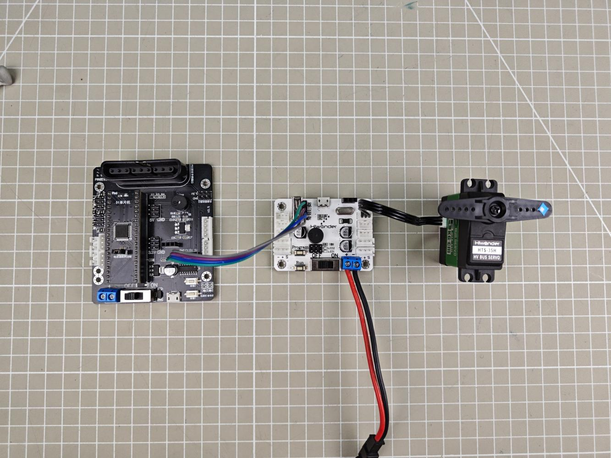

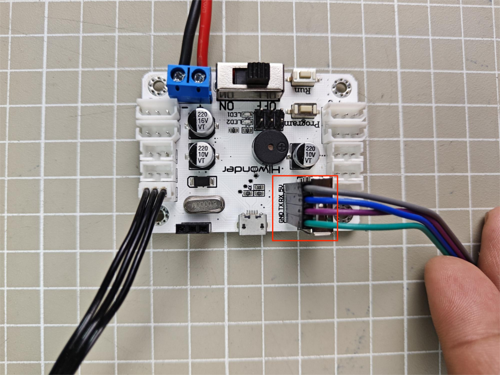

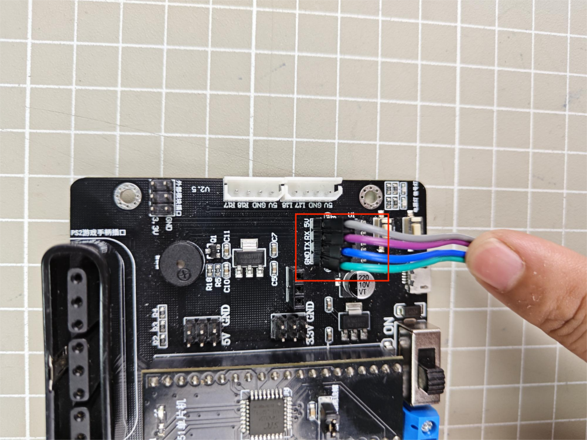

:::{Note}
*   When using **Hiwonder's** lithium battery, connect the battery cable with the red wire to the positive (+) terminal and the black wire to the negative (–) terminal of the DC port.
*   Before connecting the battery cables, make sure they are not already attached to the lithium battery. This prevents the risk of a short circuit caused by accidental contact between the positive and negative wires.
*   When connecting the serial ports, make sure to cross the RX and TX pins. As shown in the two diagrams above.
:::

* **Environment Configuration**

Install Keil4 software on PC. The software package is stored in [Appendix->C51 Software](Appendix.md). For the detailed operations of Keil4, please refer to the relevant tutorials.

### 2.3.2 Development Case

**Case 1 Control a Single Servo**

In this example, the serial port is used to send instructions to the bus servo controller, which then controls the servo to move.

* **Run Program**

[Source Code](../_static/source_code/C51_Development.zip)

(1) Open the AIapp-ISP-v6.95E in [Appendix->C51 Software](Appendix.md).


The AIapp-ISP-v6.95E configuration is shown as follow:

| **NO.** | **Actions** | **NO.** | **Actions** |
|:--:|:--:|:--:|:--:|
| 1 | Stand: `stand()` | 10 | Sit：`sit()` |
| 2 | Move a step forward: `forward()` | 11 | Left/ right foot kick: `kick_ball_left/right()` |
| 3 | Step backwards: `back()` | 12 | Dance: `moonwalk()` |
| 4 | Turn left: `turn_left()` | 13 | Lie down: `lie_down()` |
| 5 | Turn right: `turn_right()` | 14 | Have a good stretch: `temp()` |
| 6 | Box: `boxing()` | 15 | Bow: `bow()` |
| 7 | Push up: `push_up()` | 16 | Kick red ball: `kick_ball('red')` |
| 8 | Handshake: `shake_hands()` | 17 | Trace red line: `visual_patrol('red')` |
| 9 | Nod: `nod()` | 18 |  |

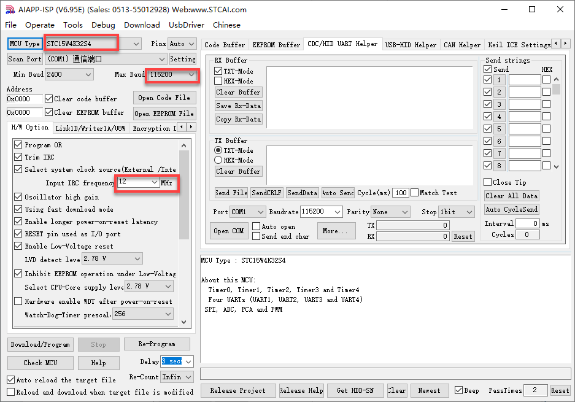

(2) Click **"Open Code File"** and find the hex file in [Case 1 Control a Single Servo/OBJ/LobotServoTurn_C51](Appendix.md).

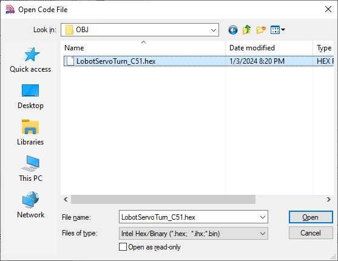

(3) After opening the program file, click **"Download/Program"** to upload the code to the 51 microcontroller.

:::{Note}
Before uploading, remove the jumper cap from the 51 microcontroller. Once the **AIapp-ISP-v6.95E** tool in the lower-right corner shows that it is detecting the target device, reinsert the jumper cap. The upload process will begin automatically.
:::

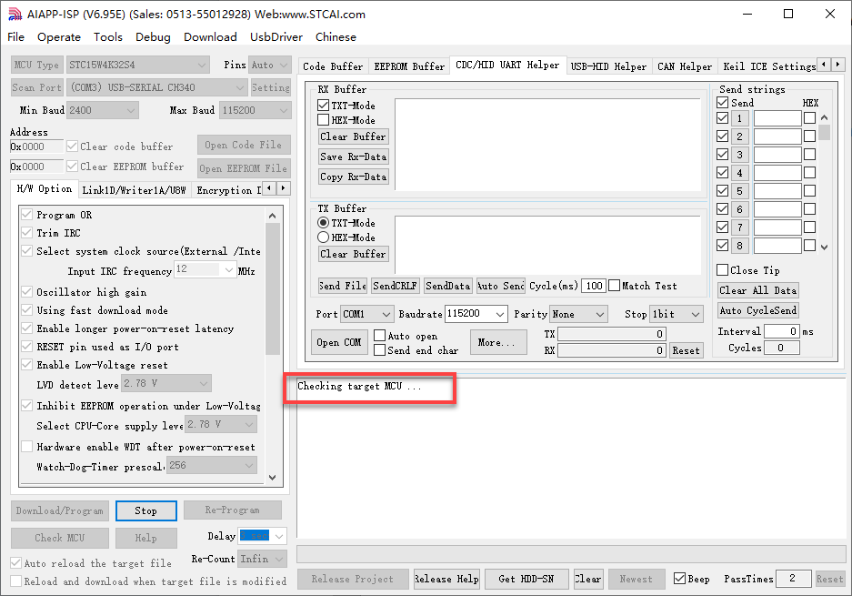


Once the upload is complete, turn on the bus servo controller's power switch, and Servo ID 1 will start moving.

* **Project Outcome**

After running the program, the servo will continuously swing back and forth between position 0 and position 1000, with a 1.5-second interval.

* **Program Brief Analysis**

[Source Code](../_static/source_code/C51_Development.zip)

(1) Import Necessary Libraries

① Import the package in `main.c` program:

{lineno-start=1}

```python
#include "include.h"
#include "lsc2d.h"
```

② Import the package in `include.h` file:

{lineno-start=4}

```python
#include <STC15.h>
#include <intrins.h>
#include "typedef.h"
#include "lsc2d.h"
```

The library includes the necessary modules for communicating with the bus servo controller. You can use the predefined variables and functions in it to control the servo.

(2) UART Initialization

{lineno-start=3}

```python
void InitUart(void)
{
	SCON = 0x50;
	AUXR = 0x16;
	AUXR |= 0x01;
	IE2 = 0x10;
	T2L = (65536 - (FOSC/4/UART4_BAUD));   //Set baud rate reload value 
  T2H = (65536 - (FOSC/4/UART4_BAUD))>>8;

}
```

In the `uart.c` file, initialize the UART by enabling `UART1` through the `SCON` register. The `AUCR` and `IE2` registers are configured so that `UART1` uses Timer 2 to generate the baud rate. Set the initial count values of `T2L` and `T2H` to configure the baud rate to `9600`.

(3) Control Servo Movement

{lineno-start=22}

```python
int main(void)
{
	InitUart();
	EA = 1;
	
	while(1)
	{
		moveServo(1, 0, 800);	//Servo 1, move to position 0, duration 800ms (1ºÅ¶æ»ú£¬×ª¶¯µ½Î»ÖÃ0£¬ÓÃʱ800ms)
		DelayMs(1500);	//Delay function, here delay for 1500ms (ÑÓʱ³ÌÐò£¬ÕâÀïÑÓʱ1500ms)
		
		moveServo(1, 1000, 800);	// Servo 1, move to position 1000, duration 800ms (1ºÅ¶æ»ú£¬×ª¶¯µ½Î»ÖÃ1000£¬ÓÃʱ800ms)
		DelayMs(1500);
	}
}
```

Before running the main program, call the `InitUart()` function to initialize the UART. Then, use functions from the `lsc2d.c` file to send data to the bus servo controller and control the servo's movement.

**Case 2 Control a Single Servo's Speed**

In this example, the serial port is used to send instructions to the bus servo controller, which then controls the servo to move.

* **Run Program**

[Source Code](../_static/source_code/Arduino_Development.zip)

(1) Open the AIapp-ISP-v6.95E in [Appendix->C51 Software](Appendix.md):


The AIapp-ISP-v6.95E configuration is shown as follow:


(2) Click **"Open Code File"** and find the hex file in [Case 2 Control a Single Servo's Speed/LobotServoSpeed_C51/OBJ](Appendix.md).

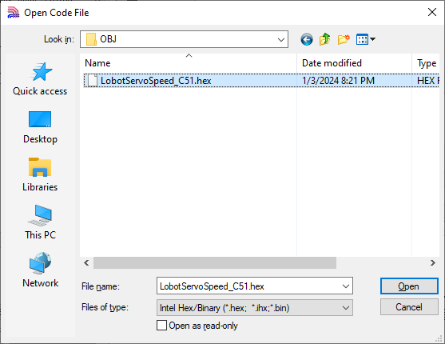

(3) After opening the program file, click **"Download/Program"** to upload the code to the 51 microcontroller.

:::{Note}
Before uploading, remove the jumper cap from the 51 microcontroller. Once the **AIapp-ISP-v6.95E** tool in the lower-right corner shows that it is detecting the target device, reinsert the jumper cap. The upload process will begin automatically.
:::

 

Once the upload is complete, turn on the bus servo controller's power switch, and Servo ID 1 will start moving.

* **Project Outcome**

After running the program, the servo will rotate from position 0 to position 1000 at a speed set to 800 ms, and then rotate back from position 1000 to position 0 at a speed set to 1200 ms.

* **Program Brief Analysis**

[Source Code](../_static/source_code/Arduino_Development.zip)

(1) Import Necessary Libraries

① Import the package in `main.c` program:

{lineno-start=1}

```python
#include "include.h"
#include "lsc2d.h"
```

② Import the package in `include.h` file:

{lineno-start=4}

```python
#include <STC15.h>
#include <intrins.h>
#include "typedef.h"
#include "lsc2d.h"
```

The library includes the necessary modules for communicating with the bus servo controller. You can use the predefined variables and functions in it to control the servo.

(2) UART Initialization

{lineno-start=3}

```python
void InitUart(void)
{
	SCON = 0x50;
	AUXR = 0x16;
	AUXR |= 0x01;
	IE2 = 0x10;
	T2L = (65536 - (FOSC/4/UART4_BAUD));   //Set baud rate reload value  
  T2H = (65536 - (FOSC/4/UART4_BAUD))>>8;

}
```

In the `uart.c` file, initialize the UART by enabling `UART1` through the `SCON` register. The `AUCR` and `IE2` registers are configured so that `UART1` uses Timer 2 to generate the baud rate. Set the initial count values of `T2L` and `T2H` to configure the baud rate to `9600`.

(3) Main Program

{lineno-start=22}

```python
int main(void)
{
	InitUart();
	EA = 1;
	
	while(1)
	{
		moveServo(1, 0, 800);	//Servo 1, move to position 0, duration 800ms  
		DelayMs(1500);
		
		moveServo(1, 1000, 800);	//Servo 1, move to position 1000, duration 800ms  
		DelayMs(1500);
		
		moveServo(1, 0, 1200);	//Servo 1, move to position 0, duration 1200ms  
		DelayMs(1500);
		
		moveServo(1, 1000, 1200);	//Servo 1, move to position 1000, duration 1200ms  
		DelayMs(1500);
	}
}
```

Before running the main program, call the `InitUart()` function to initialize the UART. Then, use functions from the `lsc2d.c` file to send data to the bus servo controller, enabling the servos to rotate at different speeds.

**Case 3 Control Multiple Servos**

In this example, the serial port is used to send instructions to the bus servo controller, which then controls multiple servos to move.

* **Run Program**

[Source Code](../_static/source_code/C51_Development.zip)

(1) Open the AIapp-ISP-v6.95E in [Appendix->C51 Software](Appendix.md):


The AIapp-ISP-v6.95E configuration is shown as follow:


(2) Click **"Open Code File"** and find the hex file in  [Case 3 Control Multiple Servos/OBJ/LobotServosTurn_C51](Appendix.md).


(3) After opening the program file, click **"Download/Program"** to upload the code to the 51 microcontroller.

:::{Note}
Before uploading, remove the jumper cap from the 51 microcontroller. Once the **AIapp-ISP-v6.95E** tool in the lower-right corner shows that it is detecting the target device, reinsert the jumper cap. The upload process will begin automatically.
:::


* **Project Outcome**

After running the program, Servo 1 and Servo 2 will move back and forth between position 0 and position 1000, with an interval of 1.5 seconds. The number of servos you can control depends on the available ports on the controller. In this example, only two servos are used, but you can modify the code to control more servos.

* **Program Brief Analysis**

[Source Code](../_static/source_code/C51_Development.zip)

(1) Import Necessary Libraries

① Import the package in `main.c` program:

{lineno-start=1}

```python
#include "include.h"
#include "lsc2d.h"
```

② Import the package in `include.h` file:

{lineno-start=4}

```python
#include <STC15.h>
#include <intrins.h>
#include "typedef.h"
#include "lsc2d.h"
```

The library includes the necessary modules for communicating with the bus servo controller. You can use the predefined variables and functions in it to control the servo.

(2) UART Initialization

{lineno-start=3}

```python
void InitUart(void)
{
	SCON = 0x50;
	AUXR = 0x16;
	AUXR |= 0x01;
	IE2 = 0x10;
	T2L = (65536 - (FOSC/4/UART4_BAUD));   //Set baud rate reload value 
  T2H = (65536 - (FOSC/4/UART4_BAUD))>>8;

}
```

In the `uart.c` file, initialize the UART by enabling `UART1` through the `SCON` register. The `AUCR` and `IE2` registers are configured so that `UART1` uses Timer 2 to generate the baud rate. Set the initial count values of `T2L` and `T2H` to configure the baud rate to `9600`.

(3) Define Servo Structure

{lineno-start=22}

```python
LobotServo servos[3];		//Define servo structure array 
```

Store the servos to be controlled and their related information in the `LobotServo` structure, which is mainly used for controlling multiple servos.

(4) Control Servo Movement

{lineno-start=24}

```python
int main(void)
{
	InitUart();
	EA = 1;
	
	servos[0].ID = 1;			//Set servo ID  
	servos[1].ID = 2;
	servos[2].ID = 3;
	
	while(1)
	{
		servos[0].Position = 0;		//Set servo position to 0 
		servos[1].Position = 0;
		servos[2].Position = 0;
		
		moveServosByArray(servos, 3, 800);		//Move 3 servos to specified positions, run time 800ms  
		DelayMs(1500);
		
		servos[0].Position = 1000;		//Change position to 1000  
		servos[1].Position = 1000;
		servos[2].Position = 1000;
		
		moveServosByArray(servos, 3, 800);	//Move 3 servos to position 1000, run time 800ms  
		DelayMs(1500);
		
	}

}
```

The servo information stored in the structure is sent to the bus servo controller via the serial port. The controller parses the received commands and moves each corresponding servo to its specified position.

**Case 4 Central Position & Deviation Adjustment**

In this example, the serial port is used to send instructions to the bus servo controller, which then controls the servo to move to central position and adjusts its deviation.

The central position is considered the initial position of the servo and serves as the zero point for rotating in both positive and negative directions. Therefore, the servo should be adjusted to its central position before attaching the servo horn.

Servo deviation is caused by the spacing of the splines on the servo arm—a mechanical limitation that can be corrected through software. In robotics, if this deviation is not addressed, it may restrict the movement of the robot and negatively impact certain motion behaviors.

* **Run Program**

[Source Code](../_static/source_code/C51_Development.zip)

(1) Open the AIapp-ISP-v6.95E in [Software->C51 Software](Appendix.md):


The AIapp-ISP-v6.95E configuration is shown as follow:


(2) Click **"Open Code File"** and find the hex file in [Case 4 Central Position & Deviation Adjustment/LobotServosDeviation_C51/OBJ](Appendix.md).

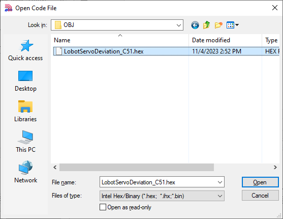

(3) After opening the program file, click **"Download/Program"** to upload the code to the 51 microcontroller.

:::{Note}
Before uploading, remove the jumper cap from the 51 microcontroller. Once the **AIapp-ISP-v6.95E** tool in the lower-right corner shows that it is detecting the target device, reinsert the jumper cap. The upload process will begin automatically.
:::


* **Project Outcome**

The servo first returns to the central position. After a short delay, it rotates to the specified deviation angle and holds that position.

* **Program Brief Analysis**

[Source Code](../_static/source_code/C51_Development.zip)

(1) Import Necessary Libraries

① Import the package in `main.c` program:

{lineno-start=1}

```python
#include "include.h"
#include "lsc2d.h"
```

② Import the package in `include.h` file:

{lineno-start=4}

```python
#include <STC15.h>
#include <intrins.h>
#include "typedef.h"
#include "lsc2d.h"
```

The library includes the necessary modules for communicating with the bus servo controller. You can use the predefined variables and functions in it to control the servo.

(2) UART Initialization

{lineno-start=3}

```python
void InitUart(void)
{
	SCON = 0x50;
	AUXR = 0x16;
	AUXR |= 0x01;
	IE2 = 0x10;
	T2L = (65536 - (FOSC/4/UART4_BAUD));   //Set baud rate reload value 
  T2H = (65536 - (FOSC/4/UART4_BAUD))>>8;

}
```

In the `uart.c` file, initialize the UART by enabling `UART1` through the `SCON` register. The `AUCR` and `IE2` registers are configured so that `UART1` uses Timer 2 to generate the baud rate. Set the initial count values of `T2L` and `T2H` to configure the baud rate to `9600`.

(3) Control Servo Movement

{lineno-start=22}

```python
uint8 deviation;	//Deviation  

int main(void)
{
	InitUart();
	EA = 1;
	
	while(1)
	{
		moveServo(1, 500, 500);	//Servo 1, move to position 500, duration 500ms  
		DelayMs(2000);	//Delay program, here delay 2000ms  
		deviation = 200;
		moveServo(1, 500+deviation, 200);	//Servo 1, move to position 700, duration 200ms  
		
		while(1);
		
	}

}
```

Before the main program runs, define the servo deviation. First, move the servo to its central position and hold for 2 seconds. Then, based on this central position, apply an additional deviation to move the servo to the new target position, and keep it at this deviation angle.

## 2.4 STM32 Development

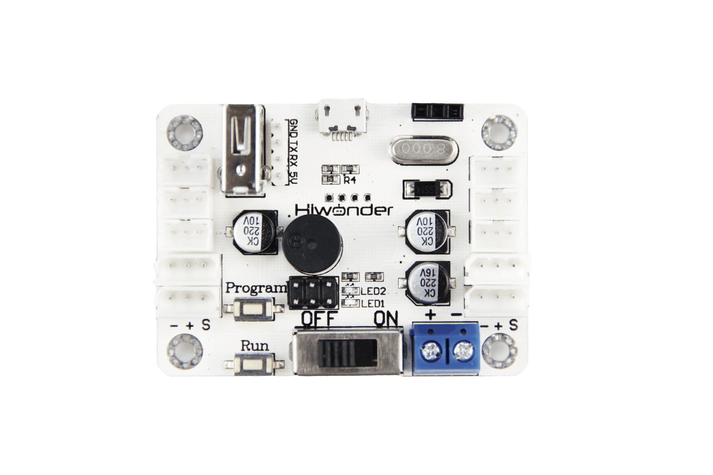

### 2.4.1 Getting Started

* **Wiring Instruction**

This section employs an open-source servo controller, STC15W4K32S4 microcontroller, and a bus servo controller for development, powered by a 7.4V 6000mAh lithium battery, or **an 11.1V battery for high-voltage servos**. Connect the serial port of the bus servo controller to the serial port of the open-source servo controller.

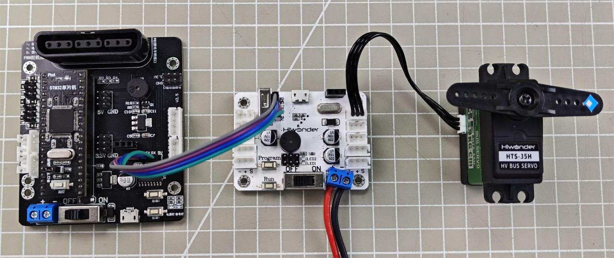

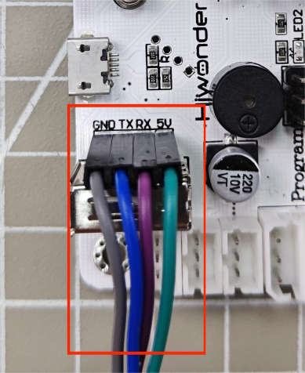

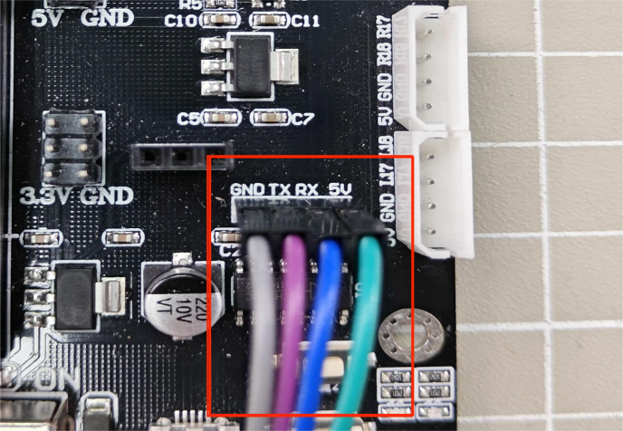

:::{Note}
*   When using **Hiwonder's** lithium battery, connect the battery cable with the red wire to the positive (+) terminal and the black wire to the negative (–) terminal of the DC port.
*   Before connecting the battery cables, make sure they are not already attached to the lithium battery. This prevents the risk of a short circuit caused by accidental contact between the positive and negative wires.
*   When connecting the serial ports, make sure to cross the RX and TX pins. As shown in the two diagrams above.
:::

* **Environment Configuration**

Install Keil5 software on PC. The software package is stored in [Appendix->STM32 Software](Appendix.md). For the detailed operations of Keil5, please refer to the relevant tutorials.

### 2.4.2 Development Case

**Case 1 Control a Single Servo**

In this example, the serial port is used to send instructions to the bus servo controller, which then controls the servo to move.

* **Run Program**

[Source Code](https://drive.google.com/drive/folders/1ocfsyLbK9hZSZ_zu5OQy1_6I-vVmwg9D?usp=sharing)

(1) Open the `mcuisp` download tool in [Appendix->STM32 Software](Appendix.md):


The `mcuisp` configuration is shown as follow:

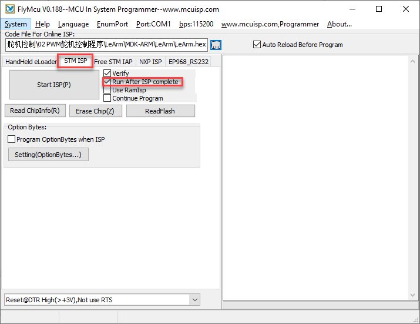

(2) Click , then find the hex file in the following folder:  

[Case 1 Control a Single Servo\PROJECT\OPT](Appendix.md)

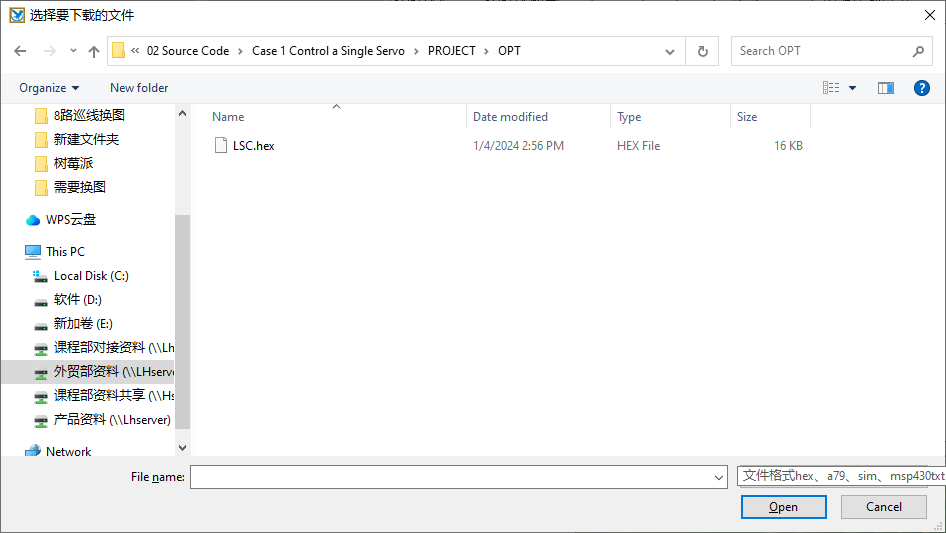

(3) After opening the program file, click **Start ISP(P)** to download the program to the STM32 microcontroller.

:::{Note}
Before downloading, remove the jumper cap from the STM32 microcontroller and press the reset button. When **"Mission Completed, Anything Ok!!!"** appears in the bottom-right corner of `mcuisp`, the download is complete. Finally, reinsert the jumper cap back onto the STM32 microcontroller.
:::

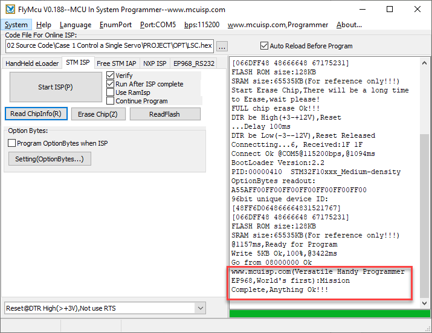

Once the upload is complete, turn on the bus servo controller's power switch, then press the reset button on the STM32 microcontroller, and Servo ID 1 will start moving.

* **Project Outcome**

After running the program, the servo will continuously swing back and forth between position 0 and position 1000, with a 1.5-second interval.

* **Program Brief Analysis**

[Source Code](https://drive.google.com/drive/folders/1ocfsyLbK9hZSZ_zu5OQy1_6I-vVmwg9D?usp=sharing)

(1) Import Necessary Libraries

① Import the package in `main.c` program:

{lineno-start=1}

```python
#include "delay.h"
#include "uart.h"
#include "LobotServoController.h"
#include "bool.h"
```

The library includes the necessary modules for communicating with the bus servo controller. You can use the predefined variables and functions in it to control the servo.

{lineno-start=6}

```python
void delay_s(int s)
{
	for(;s>0;s--)
		delay_ms(1000);
}
```

In the `main.c` file, there is a `delay` function used to create delays in seconds (s).

(2) UART Initialization

{lineno-start=39}

```python
void uartInit(u32 bound)
{
	GPIO_InitTypeDef GPIO_InitStructure;
	USART_InitTypeDef USART_InitStructure;

	RCC_APB2PeriphClockCmd(RCC_APB2Periph_USART1 | RCC_APB2Periph_GPIOA | RCC_APB2Periph_AFIO, ENABLE);
	
	//USART1_TX   PA9
	GPIO_InitStructure.GPIO_Pin = GPIO_Pin_9;
	GPIO_InitStructure.GPIO_Speed = GPIO_Speed_50MHz;
	GPIO_InitStructure.GPIO_Mode = GPIO_Mode_AF_PP;
	GPIO_Init(GPIOA, &GPIO_InitStructure);
	
	//USART1_RX	  PA10
	GPIO_InitStructure.GPIO_Pin = GPIO_Pin_10;
	GPIO_InitStructure.GPIO_Mode = GPIO_Mode_IN_FLOATING;
	GPIO_Init(GPIOA, &GPIO_InitStructure);

	//USART configuration (USART配置)
	USART_InitStructure.USART_BaudRate = bound;//Baud rate (波特率)
	USART_InitStructure.USART_WordLength = USART_WordLength_8b; //Data bits (数据位)
	USART_InitStructure.USART_StopBits = USART_StopBits_1; //Stop bit (停止位)
	USART_InitStructure.USART_Parity = USART_Parity_No; //Parity bit (校验位)
	USART_InitStructure.USART_HardwareFlowControl = USART_HardwareFlowControl_None; //Flow control (流控制)
	USART_InitStructure.USART_Mode = USART_Mode_Rx | USART_Mode_Tx; //Enable RX and TX (发送接收)

	USART_Init(USART1, &USART_InitStructure);
	uartNVICInit();
	USART_ITConfig(USART1, USART_IT_RXNE, ENABLE);
	USART_Cmd(USART1, ENABLE);
}
```

In `uart.c`, the UART is initialized by configuring `PA9` as TX (transmit) and `PA10` as RX (receive). The USART is configured with 8 data bits, 1 stop bit, no parity, no flow control, and in read/write mode.

(3) Control Servo Movement

{lineno-start=12}

```python
 int main(void)
 {
 	SystemInit();//System clock and related initialization  
	delay_init(72);	     //Initialize delay module 
	NVIC_PriorityGroupConfig(NVIC_PriorityGroup_2);//Set NVIC interrupt priority grouping: 2 bits preemption priority, 2 bits subpriority  
	uartInit(9600);//Initialize UART with baud rate 9600  
	
	while(1){
		moveServo(1, 1000, 1200); //Move servo 1 to position 1000  
		delay_s(2);
		moveServo(1, 0, 1200); //Move servo 1 to position 0  
		delay_s(2);
 }
}
```

Before running the main program, call the `SystemInit()` function to initialize the system clock, call `delay_init(72)` to initialize the delay module, and initialize the `NVIC` interrupt controller, which uses the system clock to generate interrupts for providing precise delays. Finally, initialize the UART with a baud rate of `9600`.

In the `while` loop, the `moveServo()` function is called to send data to the bus servo controller, controlling the servo's movement.

**Case 2 Control a Single Servo's Speed**

In this example, the serial port is used to send instructions to the bus servo controller, which then controls the servo to move.

* **Run Program**

[Source Code](https://drive.google.com/drive/folders/1ocfsyLbK9hZSZ_zu5OQy1_6I-vVmwg9D?usp=sharing)

(1) Open the `mcuisp` download tool in [Appendix->STM32 Software](Appendix.md):


The `mcuisp` configuration is shown as follow:


(2) Click , then find the hex file in the following folder:  

[Case 2 Control a Single Servo's Speed\PROJECT\OPT](Appendix.md)


(3) After opening the program file, click **Start ISP(P)** to download the program to the STM32 microcontroller.

:::{Note}
Before downloading, remove the jumper cap from the STM32 microcontroller and press the reset button. When **"Mission Completed, Anything Ok!!!"** appears in the bottom-right corner of `mcuisp`, the download is complete. Finally, reinsert the jumper cap back onto the STM32 microcontroller.
:::


Once the upload is complete, turn on the bus servo controller's power switch, then press the reset button on the STM32 microcontroller, and Servo ID 1 will start moving.

* **Project Outcome**

After running the program, the servo will rotate from position 0 to position 1000 at a speed set to 1200 ms, and then rotate back from position 1000 to position 0 at a speed set to 500 ms.

* **Program Brief Analysis**

[Source Code](https://drive.google.com/drive/folders/1ocfsyLbK9hZSZ_zu5OQy1_6I-vVmwg9D?usp=sharing)

(1) Import Necessary Libraries

① Import the package in `main.c` program:

{lineno-start=1}

```python
#include "delay.h"
#include "uart.h"
#include "LobotServoController.h"
#include "bool.h"
```

The library includes the necessary modules for communicating with the bus servo controller. You can use the predefined variables and functions in it to control the servo.

{lineno-start=6}

```python
void delay_s(int s)
{
	for(;s>0;s--)
		delay_ms(1000);
}
```

In the `main.c` file, there is a `delay` function used to create delays in seconds (s).

(2) UART Initialization

{lineno-start=39}

```python
void uartInit(u32 bound)
{
	GPIO_InitTypeDef GPIO_InitStructure;
	USART_InitTypeDef USART_InitStructure;

	RCC_APB2PeriphClockCmd(RCC_APB2Periph_USART1 | RCC_APB2Periph_GPIOA | RCC_APB2Periph_AFIO, ENABLE);
	
	//USART1_TX   PA9
	GPIO_InitStructure.GPIO_Pin = GPIO_Pin_9;
	GPIO_InitStructure.GPIO_Speed = GPIO_Speed_50MHz;
	GPIO_InitStructure.GPIO_Mode = GPIO_Mode_AF_PP;
	GPIO_Init(GPIOA, &GPIO_InitStructure);
	
	//USART1_RX	  PA10
	GPIO_InitStructure.GPIO_Pin = GPIO_Pin_10;
	GPIO_InitStructure.GPIO_Mode = GPIO_Mode_IN_FLOATING;
	GPIO_Init(GPIOA, &GPIO_InitStructure);

	//USART configuration (USART配置)
	USART_InitStructure.USART_BaudRate = bound;//Baud rate (波特率)
	USART_InitStructure.USART_WordLength = USART_WordLength_8b; //Data bits (数据位)
	USART_InitStructure.USART_StopBits = USART_StopBits_1; //Stop bit (停止位)
	USART_InitStructure.USART_Parity = USART_Parity_No; //Parity bit (校验位)
	USART_InitStructure.USART_HardwareFlowControl = USART_HardwareFlowControl_None; //Flow control (流控制)
	USART_InitStructure.USART_Mode = USART_Mode_Rx | USART_Mode_Tx; //Enable RX and TX (发送接收)

	USART_Init(USART1, &USART_InitStructure);
	uartNVICInit();
	USART_ITConfig(USART1, USART_IT_RXNE, ENABLE);
	USART_Cmd(USART1, ENABLE);
}
```

In `uart.c`, the UART is initialized by configuring `PA9` as TX (transmit) and `PA10` as RX (receive). The USART is configured with 8 data bits, 1 stop bit, no parity, no flow control, and in read/write mode.

(3) Main Program

{lineno-start=}

```python
 int main(void)
 {
 	SystemInit();//System clock and other initialization 
	delay_init(72);	     //Initialize delay function 
	NVIC_PriorityGroupConfig(NVIC_PriorityGroup_2);//Set NVIC interrupt grouping to Group 2: 2 bits preemption priority, 2 bits subpriority 
	uartInit(9600);//Initialize UART at 9600 baud rate 
	
	
	while(1){
		moveServo(1, 1000, 1200); //Move servo 1 to position 1000 
		delay_s(2);
		moveServo(1, 0, 1200); //Move servo 1 to position 0 
		delay_s(2);
		moveServo(1, 1000, 500); //Move servo 1 to position 1000 
		delay_s(1);
		moveServo(1, 0, 500); //Move servo 1 to position 0 
		delay_s(1);
 }
}
```

In the `while` loop, the `moveServo()` function is called to move Servo ID 1 to position 1000 in 1200 ms, and then back to position 0. Then, in the same way, move the servo to the desired position in 500 ms.

**Case 3 Control Multiple Servos**

In this example, the serial port is used to send instructions to the bus servo controller, which then controls multiple servos to move.

* **Run Program**

[Source Code](https://drive.google.com/drive/folders/1ocfsyLbK9hZSZ_zu5OQy1_6I-vVmwg9D?usp=sharing)

(1) Open the `mcuisp` download tool in [Appendix->STM32 Software](Appendix.md):


The `mcuisp` configuration is shown as follow:


(2) Click , then find the hex file in the following folder:  

[Source Code\Case 3 Control Multiple Servos\PROJECT\OPT](Appendix.md)


(3) After opening the program file, click **Start ISP(P)** to download the program to the STM32 microcontroller.

:::{Note}
Before downloading, remove the jumper cap from the STM32 microcontroller and press the reset button. When **"Mission Completed, Anything Ok!!!"** appears in the bottom-right corner of `mcuisp`, the download is complete. Finally, reinsert the jumper cap back onto the STM32 microcontroller.
:::


Once the upload is complete, turn on the bus servo controller's power switch, then press the reset button on the STM32 microcontroller, and Servo ID 1 will start moving.

* **Project Outcome**

After running the program, Servo 1, Servo 2 and Servo 3 will move back and forth between position 0 and position 1000, with an interval of 1.5 seconds. The number of servos you can control depends on the available ports on the controller. In this example, only two servos are used, but you can modify the code to control more servos.

* **Program Brief Analysis**

[Source Code](https://drive.google.com/drive/folders/1ocfsyLbK9hZSZ_zu5OQy1_6I-vVmwg9D?usp=sharing)

(1) Import Necessary Libraries

① Import the package in `main.c` program:

{lineno-start=1}

```python
#include "delay.h"
#include "uart.h"
#include "LobotServoController.h"
#include "bool.h"
```

The library includes the necessary modules for communicating with the bus servo controller. You can use the predefined variables and functions in it to control the servo.

{lineno-start=6}

```python
void delay_s(int s)
{
	for(;s>0;s--)
		delay_ms(1000);
}
```

In the `main.c` file, there is a `delay` function used to create delays in seconds (s).

(2) UART Initialization

{lineno-start=39}

```python
void uartInit(u32 bound)
{
	GPIO_InitTypeDef GPIO_InitStructure;
	USART_InitTypeDef USART_InitStructure;

	RCC_APB2PeriphClockCmd(RCC_APB2Periph_USART1 | RCC_APB2Periph_GPIOA | RCC_APB2Periph_AFIO, ENABLE);
	
	//USART1_TX   PA9
	GPIO_InitStructure.GPIO_Pin = GPIO_Pin_9;
	GPIO_InitStructure.GPIO_Speed = GPIO_Speed_50MHz;
	GPIO_InitStructure.GPIO_Mode = GPIO_Mode_AF_PP;
	GPIO_Init(GPIOA, &GPIO_InitStructure);
	
	//USART1_RX	  PA10
	GPIO_InitStructure.GPIO_Pin = GPIO_Pin_10;
	GPIO_InitStructure.GPIO_Mode = GPIO_Mode_IN_FLOATING;
	GPIO_Init(GPIOA, &GPIO_InitStructure);

	//USART configuration (USART配置)
	USART_InitStructure.USART_BaudRate = bound;//Baud rate (波特率)
	USART_InitStructure.USART_WordLength = USART_WordLength_8b; //Data bits (数据位)
	USART_InitStructure.USART_StopBits = USART_StopBits_1; //Stop bit (停止位)
	USART_InitStructure.USART_Parity = USART_Parity_No; //Parity bit (校验位)
	USART_InitStructure.USART_HardwareFlowControl = USART_HardwareFlowControl_None; //Flow control (流控制)
	USART_InitStructure.USART_Mode = USART_Mode_Rx | USART_Mode_Tx; //Enable RX and TX (发送接收)

	USART_Init(USART1, &USART_InitStructure);
	uartNVICInit();
	USART_ITConfig(USART1, USART_IT_RXNE, ENABLE);
	USART_Cmd(USART1, ENABLE);
}
```

In `uart.c`, the UART is initialized by configuring `PA9` as TX (transmit) and `PA10` as RX (receive). The USART is configured with 8 data bits, 1 stop bit, no parity, no flow control, and in read/write mode.

(3) Define Servo Structure

{lineno-start=12}

```python
LobotServo servos[3];
```

Store the servos to be controlled and their related information in the `LobotServo` structure, which is mainly used for controlling multiple servos.

(4) Control Servo Movement

{lineno-start=12}

```python
LobotServo servos[3];

 int main(void)
 {
 	SystemInit();//System clock and other initialization  
	delay_init(72);	     //Initialize delay function  
	NVIC_PriorityGroupConfig(NVIC_PriorityGroup_2);// Set NVIC interrupt group 2: 2 bits preemption priority, 2 bits subpriority  
	uartInit(9600);//Initialize UART at 9600 baud rate  
	servos[0].ID = 1;			//Set servo IDs 
	servos[1].ID = 2;
	servos[2].ID = 3;
	
	while(1)
	{
		servos[0].Position = 0;		//Set servo positions to 0  
		servos[1].Position = 0;
		servos[2].Position = 0;
		
		moveServosByArray(servos, 3, 1200);		//Move 3 servos to specified positions with 1200ms duration  
		delay_s(2);
		
		servos[0].Position = 1000;		//Change positions to 1000  
		servos[1].Position = 1000;
		servos[2].Position = 1000;
		
		moveServosByArray(servos, 3, 1200);	//Move 3 servos to position 1000 with 1200ms duration  
		delay_s(2);
		
	}
}
```

The servo information stored in the structure is sent to the bus servo controller via the serial port. The controller parses the received commands and moves each corresponding servo to its specified position.

**Case 4 Central Position & Deviation Adjustment**

In this example, the serial port is used to send instructions to the bus servo controller, which then controls the servo to move to central position and adjusts its deviation.

The central position is considered the initial position of the servo and serves as the zero point for rotating in both positive and negative directions. Therefore, the servo should be adjusted to its central position before attaching the servo horn.

Servo deviation is caused by the spacing of the splines on the servo arm—a mechanical limitation that can be corrected through software. In robotics, if this deviation is not addressed, it may restrict the movement of the robot and negatively impact certain motion behaviors.

* **Run Program**

[Source Code](https://drive.google.com/drive/folders/1ocfsyLbK9hZSZ_zu5OQy1_6I-vVmwg9D?usp=sharing)

(1) Open the `mcuisp` download tool in [Appendix->STM32 Software](Appendix.md):


The `mcuisp` configuration is shown as follow:


(2) Click , then find the hex file in the following folder:  

[Case 4 Central Position & Deviation Adjustment\PROJECT\OPT](Appendix.md)


(3) After opening the program file, click **Start ISP(P)** to download the program to the STM32 microcontroller.

:::{Note}
Before downloading, remove the jumper cap from the STM32 microcontroller and press the reset button. When **"Mission Completed, Anything Ok!!!"** appears in the bottom-right corner of `mcuisp`, the download is complete. Finally, reinsert the jumper cap back onto the STM32 microcontroller.
:::


Once the upload is complete, turn on the bus servo controller's power switch, then press the reset button on the STM32 microcontroller, and Servo ID 1 will start moving.

* **Project Outcome**

The servo first returns to the central position. After a short delay, it rotates to the specified deviation angle and holds that position.

* **Program Brief Analysis**

[Source Code](https://drive.google.com/drive/folders/1ocfsyLbK9hZSZ_zu5OQy1_6I-vVmwg9D?usp=sharing)

(1) Import Necessary Libraries

① Import the package in `main.c` program:

{lineno-start=1}

```python
#include "delay.h"
#include "uart.h"
#include "LobotServoController.h"
#include "bool.h"
```

The library includes the necessary modules for communicating with the bus servo controller. You can use the predefined variables and functions in it to control the servo.

{lineno-start=6}

```python
void delay_s(int s)
{
	for(;s>0;s--)
		delay_ms(1000);
}
```

In the `main.c` file, there is a `delay` function used to create delays in seconds (s).

(2) UART Initialization

{lineno-start=39}

```python
void uartInit(u32 bound)
{
	GPIO_InitTypeDef GPIO_InitStructure;
	USART_InitTypeDef USART_InitStructure;

	RCC_APB2PeriphClockCmd(RCC_APB2Periph_USART1 | RCC_APB2Periph_GPIOA | RCC_APB2Periph_AFIO, ENABLE);
	
	//USART1_TX   PA9
	GPIO_InitStructure.GPIO_Pin = GPIO_Pin_9;
	GPIO_InitStructure.GPIO_Speed = GPIO_Speed_50MHz;
	GPIO_InitStructure.GPIO_Mode = GPIO_Mode_AF_PP;
	GPIO_Init(GPIOA, &GPIO_InitStructure);
	
	//USART1_RX	  PA10
	GPIO_InitStructure.GPIO_Pin = GPIO_Pin_10;
	GPIO_InitStructure.GPIO_Mode = GPIO_Mode_IN_FLOATING;
	GPIO_Init(GPIOA, &GPIO_InitStructure);

	//USART configuration (USART配置)
	USART_InitStructure.USART_BaudRate = bound;//Baud rate (波特率)
	USART_InitStructure.USART_WordLength = USART_WordLength_8b; //Data bits (数据位)
	USART_InitStructure.USART_StopBits = USART_StopBits_1; //Stop bit (停止位)
	USART_InitStructure.USART_Parity = USART_Parity_No; //Parity bit (校验位)
	USART_InitStructure.USART_HardwareFlowControl = USART_HardwareFlowControl_None; //Flow control (流控制)
	USART_InitStructure.USART_Mode = USART_Mode_Rx | USART_Mode_Tx; //Enable RX and TX (发送接收)

	USART_Init(USART1, &USART_InitStructure);
	uartNVICInit();
	USART_ITConfig(USART1, USART_IT_RXNE, ENABLE);
	USART_Cmd(USART1, ENABLE);
}
```

In `uart.c`, the UART is initialized by configuring `PA9` as TX (transmit) and `PA10` as RX (receive). The USART is configured with 8 data bits, 1 stop bit, no parity, no flow control, and in read/write mode.

(3) Control Servo Movement

{lineno-start=}

```python
 int main(void)
 {
	int deviation;
 	SystemInit();//System clock and other initialization  
	delay_init(72);	     //Initialize delay function  
	NVIC_PriorityGroupConfig(NVIC_PriorityGroup_2);//Set NVIC interrupt group 2: 2 bits preemption priority, 2 bits subpriority 
	uartInit(9600);//Initialize UART at 9600 baud rate 

	moveServo(1, 500, 500);	// Servo 1 moves to position 500 in 500ms 
	delay_s(2);	//Delay for 2 seconds 
	deviation = 80;
	moveServo(1, 500+deviation, 200);	//Servo 1 moves to position 580 in 200ms 
	while(1);
}
```

Before the main program runs, define the servo deviation. First, move the servo to its central position and hold for 2 seconds. Then, based on this central position, apply an additional deviation to move the servo to the new target position, and keep it at this deviation angle.

## 2.5 Raspberry Pi Development

### 2.5.1 Getting Started

* **Wiring Instruction**

This example uses an Raspberry Pi controller and a bus servo controller, powered by a 11.1V 6000mAh lithium battery, or an 7.4V battery for low-voltage servos. Connect the serial port of the bus servo controller to the serial port of the open-source servo controller.

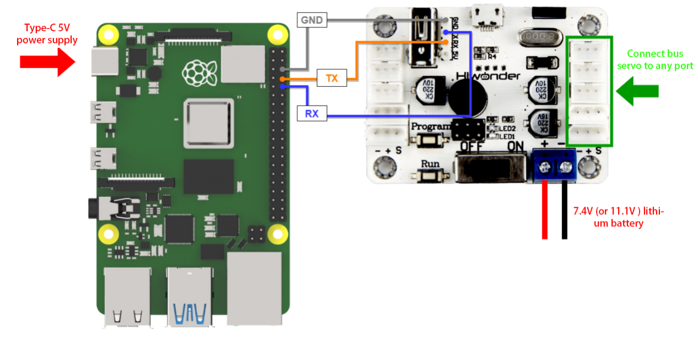

:::{Note}
*   When using **Hiwonder's** lithium battery, connect the battery cable with the red wire to the positive (+) terminal and the black wire to the negative (–) terminal of the DC port.
*   Before connecting the battery cables, make sure they are not already attached to the lithium battery. This prevents the risk of a short circuit caused by accidental contact between the positive and negative wires.
*   When connecting the serial ports, make sure to cross the RX and TX pins.
:::

* **Environment Configuration**

Install NoMachine software on PC. The software package is stored in [Appendix-> Remote Connection Software](Appendix.md). For the detailed operations of NoMachine, please refer to the relevant tutorials.

Drag the program and SDK library files into the Raspberry Pi system image, using the desktop as an example.

:::{Note}
Make sure the library files are placed in the same directory as the program.
:::

Open the command-line terminal and enter the following command to add execution permissions:

```
sudo chmod a+x Raspberry_BusServoControl_demo/
```

### 2.5.2 Development Case

**Case 1 Control a Single Servo**

In this example, the serial port is used to send instructions to the bus servo controller, which then controls the servo to move.

* **Run Program**

[Source Code](../_static/source_code/Raspberry_Pi_Development.zip)

(1) Open a new terminal and enter the following command to navigate to the program directory:

```
cd Raspberry_BusServoControl_demo/
```

(2) Run the program by entering:

```
python3 BusServoControl.py
```

* **Project Outcome**

After running the program, the servo will continuously swing back and forth between position 0 and position 1000, with a 2-second interval.

* **Program Brief Analysis**

[Source Code](../_static/source_code/Raspberry_Pi_Development.zip)

(1) Import Necessary Libraries

{lineno-start=1}

```python
import ServoControl
```

The library includes the necessary modules for communicating with the bus servo controller. You can use the predefined variables and functions in it to control the servo. In the `ServoControl` library file, the main method called is `setBusServoMove()`.

① According to the communication protocol, the frame header, data length, command, and the number of servos to be controlled are first sent to the serial port.

{lineno-start=13}

```python
#Control single bus servo movement (控制单个总线舵机转动)
def setBusServoMove(servo_id, servo_pulse, time):
    buf = bytearray(b'\x55\x55')  #Frame header (帧头)
    buf.append(0x08) #Data length (数据长度)
    buf.append(LOBOT_CMD_SERVO_MOVE) #Command (指令)
    buf.append(0x01) #Number of servos to control (要控制的舵机个数)
    
    time = 0 if time < 0 else time
    time = 30000 if time > 30000 else time
    time_list = list(time.to_bytes(2, 'little'))    #Time (时间)
    buf.append(time_list[0])
    buf.append(time_list[1])    

    servo_id = 254 if (servo_id < 1 or servo_id > 254) else servo_id
    buf.append(servo_id) #id
    
    servo_pulse = 0 if servo_pulse < 0 else servo_pulse
    servo_pulse = 1000 if servo_pulse > 1000 else servo_pulse
    pulse_list = list(servo_pulse.to_bytes(2, 'little'))    #
    buf.append(pulse_list[0])
    buf.append(pulse_list[1])     

    serialHandle.write(buf)
```

② Next, the time parameter passed in is filtered to ensure it falls within the range of (0, 30000). Values outside this range are clamped to 0 and 30000, respectively. This ensures that after the data is sent over the serial port, the controller can correctly recognize it. Then, the time parameter is split into high and low bytes using `list()`, where **'little'** indicates low byte first. These two bytes are then sent to the serial port.

{lineno-start=39}

```python
    buf = bytearray(b'\x55\x55')  # Frame header (帧头)
    buf.append(0x08) #Data length (数据长度)
    buf.append(LOBOT_CMD_SERVO_MOVE) #Command (指令)
    buf.append(0x01) #要Number of servos to control (要控制的舵机个数)
```

③ After that, the ID and position values are also filtered. If the incoming ID is less than 1 or greater than 254, it is clamped to 1 or 254, respectively. Note that 254 means **"control all servos."** The position value is handled similarly: values below 0 are set to 0.

{lineno-start=44}

```python
    time = 0 if time < 0 else time
    time = 30000 if time > 30000 else time
    time_list = list(time.to_bytes(2, 'little'))    #Time (时间)
    buf.append(time_list[0])
    buf.append(time_list[1])   
```

④ Finally, the `buf` data is sent to the serial port using the `write()` method.

{lineno-start=50}

```python
    servo_id = 254 if (servo_id < 1 or servo_id > 254) else servo_id
    buf.append(servo_id) #Servo ID (舵机ID)
    
    servo_pulse = 500 if servo_pulse < 500 else servo_pulse
    servo_pulse = 2500 if servo_pulse > 2500 else servo_pulse
    pulse_list = list(servo_pulse.to_bytes(2, 'little'))    #Position (位置)
    buf.append(pulse_list[0])
    buf.append(pulse_list[1]) 
```

{lineno-start=35}

```python
    serialHandle.write(buf)
```

(2) UART Initialization

{lineno-start=59}

```python
    serialHandle.write(buf)
```

Create an instance of the servo control object and set the baud rate to `9600`.

(3) Control Servo Movement

{lineno-start=4}

```python
if __name__ == '__main__': 
    while True:
        ServoControl.setBusServoMove(1, 0, 1000)
        time.sleep(2)
        ServoControl.setBusServoMove(1, 1000, 1000)
        time.sleep(2)
```

After the main program runs in `BusServoControl`, it calls the `setBusServoMove()` function to control Servo ID 1 to move from position 0 to 1000.

**Case 2 Control a Single Servo's Speed**

In this example, the serial port is used to send instructions to the bus servo controller, which then controls the servo to move.

* **Run Program**

[Source Code](../_static/source_code/Raspberry_Pi_Development.zip)

(1) Open a new terminal and enter the following command to navigate to the program directory:

```
cd Raspberry_BusServoControl_demo/
```

(2) Run the program by entering:

```
python3 BusServoSpeed.py
```

* **Project Outcome**

After running the program, the servo will rotate from position 0 to position 1000 at a speed set to 800 ms, and then rotate back from position 1000 to position 0 at a speed set to 1200 ms.

* **Program Brief Analysis**

[Source Code](../_static/source_code/Raspberry_Pi_Development.zip)

(1) Import Necessary Libraries

{lineno-start=1}

```python
import ServoControl
```

The library includes the necessary modules for communicating with the bus servo controller. You can use the predefined variables and functions in it to control the servo. In the `ServoControl` library, the main method used is `setBusServoMove()`, which changes the servo speed by adjusting the movement duration.

(2) UART Initialization

{lineno-start=11}

```python
serialHandle = serial.Serial("/dev/ttyAMA0", 9600)  # Initialize serial port, baud rate 9600 (初始化串口，波特率为9600)
```

Create an instance of the servo control object and set the baud rate to `9600`.

(3) Control Servo Movement

{lineno-start=3}

```python
if __name__ == '__main__': 
    while True:
        ServoControl.setBusServoMove(1, 0, 1200)
        time.sleep(2)
        ServoControl.setBusServoMove(1, 1000, 1200)
        time.sleep(2)
        ServoControl.setBusServoMove(1, 0, 400)
        time.sleep(1)
        ServoControl.setBusServoMove(1, 1000, 400)
        time.sleep(1)
```

In the main program of `BusServoControl`, the `setBusServoMove()` function is first called to move Servo ID 1 from position 0 to 1000 over 1200 ms. Then, Servo ID 1 is moved back from position 1000 to 0 over 400 ms. When the rotation angle is the same, a shorter duration results in a higher speed.

**Case 3 Control Multiple Servos**

In this example, the serial port is used to send instructions to the bus servo controller, which then controls multiple servos to move.

* **Run Program**

[Source Code](../_static/source_code/Raspberry_Pi_Development.zip)

(1) Open a new terminal and enter the following command to navigate to the program directory:

```
cd Raspberry_BusServoControl_demo/
```

(2) Run the program by entering:

```
python3 BusServoMoveByArray.py
```

* **Project Outcome**

After running the program, Servo 1 and Servo 2 will move back and forth between position 0 and position 1000, with an interval of 1.5 seconds. The number of servos you can control depends on the available ports on the controller. In this example, only two servos are used, but you can modify the code to control more servos.

* **Program Brief Analysis**

[Source Code](../_static/source_code/Raspberry_Pi_Development.zip)

(1) Import Necessary Libraries

{lineno-start=1}

```python
import ServoControl
```

The library includes the necessary modules for communicating with the bus servo controller. You can use the predefined variables and functions in it to control the servo. In this example, the `setBusServoMoveByArray()` method is mainly used to control multiple servos.

① According to the communication protocol, the frame header, data length, command, and the number of servos to be controlled are first sent to the serial port.

{lineno-start=13}

```python
#Control single bus servo movement (控制单个总线舵机转动)
def setBusServoMove(servo_id, servo_pulse, time):
    buf = bytearray(b'\x55\x55')  # Frame header (帧头)
    buf.append(0x08) #Data length (数据长度)
    buf.append(LOBOT_CMD_SERVO_MOVE) #Command (指令)
    buf.append(0x01) #Number of servos to control (要控制的舵机个数)
    
    time = 0 if time < 0 else time
    time = 30000 if time > 30000 else time
    time_list = list(time.to_bytes(2, 'little'))    #Time (时间)
    buf.append(time_list[0])
    buf.append(time_list[1])    

    servo_id = 254 if (servo_id < 1 or servo_id > 254) else servo_id
    buf.append(servo_id) #id
    
    servo_pulse = 0 if servo_pulse < 0 else servo_pulse
    servo_pulse = 1000 if servo_pulse > 1000 else servo_pulse
    pulse_list = list(servo_pulse.to_bytes(2, 'little'))    #
    buf.append(pulse_list[0])
    buf.append(pulse_list[1])     

    serialHandle.write(buf)
```

② Exception filtering for servo count and rotation time is performed to ensure that the bus servo controller can correctly recognize the data sent via the serial port.

{lineno-start=39}

```python
    buf = bytearray(b'\x55\x55')  # Frame header (帧头)
    buf.append(0x08) #Data length (数据长度)
    buf.append(LOBOT_CMD_SERVO_MOVE) #Command (指令)
```

③ A `for` loop is used to send data from the servos list to the serial port. Set every two elements as one group: the first element is the servo ID, and the second is the target position. For example: `list = [1, 500, 2, 300]` means that servo ID 1 will move to position 500, and servo ID 2 will move to position 300. Finally, the `buf` data is sent to the serial port using the `write()` method.

{lineno-start=67}

```python
    servos_count = 1 if servos_count < 1 else servos_count
    servos_count = 254 if servos_count > 254 else servos_count
    buf.append(servos_count) #Number of servos to control (要控制的舵机个数)
    
    time = 0 if time < 0 else time
    time = 30000 if time > 30000 else time
    time_list = list(time.to_bytes(2, 'little'))
    buf.append(time_list[0])    #Time (时间)
    buf.append(time_list[1])
```

{lineno-start=77}

```python
    for i in range(servos_count):
        buf.append(servos[i*2])  #Servo ID (舵机ID)
        pos = servos[i*2+1]
        pos = 0 if pos < 0 else pos
        pos = 1000 if pos > 1000 else pos
        pos_list = list(pos.to_bytes(2, 'little'))
        buf.append(pos_list[0])    #Position (位置)
        buf.append(pos_list[1])
```

(2) UART Initialization

{lineno-start=11}

```python
serialHandle = serial.Serial("/dev/ttyAMA0", 9600)  # Initialize serial port, baud rate 9600 (初始化串口，波特率为9600)
```

Create an instance of the servo control object and set the baud rate to `9600`.

(3) Control Servo Movement

{lineno-start=3}

```python
if __name__ == '__main__': 
    while True:
        servos = [1, 1000, 2, 0]
        ServoControl.setMoreBusServoMove(servos, 2, 1000)
        time.sleep(2)
        servos = [1, 0, 2, 1000]
        ServoControl.setMoreBusServoMove(servos, 2, 1000)
        time.sleep(2)
```

In the main program of `ServoControl`, a servos queue is first created to set servo ID 1 to position 1000 and servo ID 2 to position 0. Then, the `setBusServoMoveByArray()` function is called to move these two servos to their target positions within 1000 ms. After a 2-second delay, servo ID 1 is set to position 0 and servo ID 2 to position 1000. Then, the `setBusServoMoveByArray()` function is called again to move the servos, also with a duration of 1000 ms.

**Case 4 Central Position & Deviation Adjustment**

In this example, the serial port is used to send instructions to the bus servo controller, which then controls the servo to move to central position and adjusts its deviation.

The central position is considered the initial position of the servo and serves as the zero point for rotating in both positive and negative directions. Therefore, the servo should be adjusted to its central position before attaching the servo horn.

Servo deviation is caused by the spacing of the splines on the servo arm—a mechanical limitation that can be corrected through software. In robotics, if this deviation is not addressed, it may restrict the movement of the robot and negatively impact certain motion behaviors.

* **Run Program**

[Source Code](../_static/source_code/Raspberry_Pi_Development.zip)

(1) Open a new terminal and enter the following command to navigate to the program directory:

```
cd Raspberry_BusServoControl_demo/
```

(2) Run the program by entering:

```
python3 BusServoMedAndBias.py
```

* **Project Outcome**

The servo first returns to the central position. After a short delay, it rotates to the specified deviation angle and holds that position.

* **Program Brief Analysis**

[Source Code](../_static/source_code/Raspberry_Pi_Development.zip)

(1) Import Necessary Libraries

{lineno-start=1}

```python
import ServoControl
```

The library includes the necessary modules for communicating with the bus servo controller. You can use the predefined variables and functions in it to control the servo. In the `ServoControl` library file, the main method called is `setBusServoMove()`.

(2) UART Initialization

{lineno-start=11}

```python
serialHandle = serial.Serial("/dev/ttyAMA0", 9600)  # Initialize serial port, baud rate 9600 (初始化串口，波特率为9600)
```

Create an instance of the servo control object and set the baud rate to `9600`.

(3) Control Servo Movement

{lineno-start=4}

```python
if __name__ == '__main__': 
    deviation = 30
    ServoControl.setBusServoMove(1, 500, 800)
    time.sleep(2)
    ServoControl.setBusServoMove(1, 500+deviation, 800)
    while True:
        time.sleep(1)
```

In the main program of `BusServoControl`, a variable named `deviation` is first created to store the deviation value. The `setBusServoMove()` function is initially called to move servo ID 1 to position 500 within 800 ms. After a 2-second delay, the servo is moved again based on its previous position (500) plus the deviation value, thereby achieving a software-based deviation adjustment.

## 2.6 Jetson Development

### 2.6.1 Getting Started

* **Wiring Instruction**

This example uses an Jetson Nano controller and a bus servo controller, powered by a 11.1V 6000mAh lithium battery, or an 7.4V battery for low-voltage servos. Connect the serial port of the bus servo controller to the serial port of the open-source servo controller.

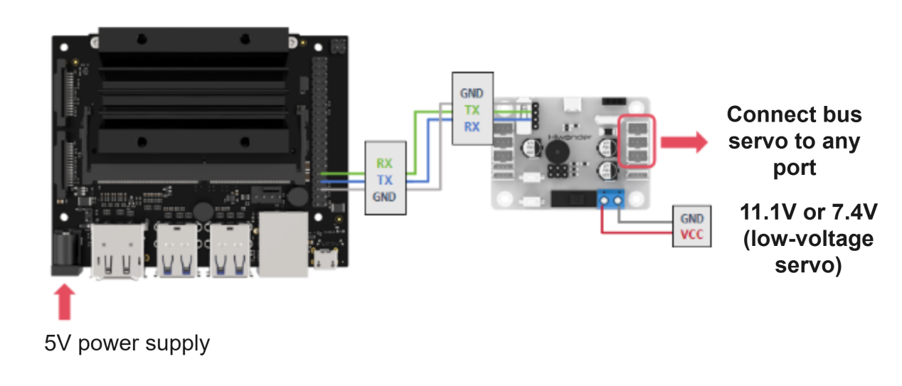

:::{Note}
*   When using **Hiwonder's** lithium battery, connect the battery cable with the red wire to the positive (+) terminal and the black wire to the negative (–) terminal of the DC port.
*   Before connecting the battery cables, make sure they are not already attached to the lithium battery. This prevents the risk of a short circuit caused by accidental contact between the positive and negative wires.
*   When connecting the serial ports, make sure to cross the RX and TX pins.
:::

* **Environment Configuration**

Install NoMachine software on PC. The software package is stored in  [Appendix-> Remote Connection Software](Appendix.md) . For the detailed operations of NoMachine, please refer to the relevant tutorials.

Drag the program and the SDK library files into the Raspberry Pi system image. This example places the file in the `/home/hiwonder/Desktop/Jetson_BusServoControl_demo` directory.

:::{Note}
Make sure the library files are placed in the same directory as the program.
:::

Open the command-line terminal and enter the following command to add execution permissions:

```
sudo find /home/hiwonder/Desktop/Jetson_BusServoControl_demo -type f -name "*.py" -exec chmod a+x {} \
```

:::{Note}
Replace the directory in the command with the root directory of your own example folder.
:::

### 2.6.2 Development Case

**Case 1 Control a Single Servo**

In this example, the serial port is used to send instructions to the bus servo controller, which then controls the servo to move.

* **Run Program**

[Source Code](../_static/source_code/Jetson_Development.zip)

(1) Open a new terminal and enter the following command to navigate to the program directory:

```
cd /home/hiwonder/Desktop/Jetson_BusServoControl_demo/single_servo_control_turn
```

(2) Run the program by entering:

```
sudo python3 BusServoControl.py
```

* **Project Outcome**

After running the program, the servo will continuously swing back and forth between position 0 and position 1000, with a 2-second interval.

* **Program Brief Analysis**

[Source Code](../_static/source_code/Jetson_Development.zip)

(1) Import Necessary Libraries

{lineno-start=1}

```python
from ServoControl import setBusServoMove
import time
```

The library includes the necessary modules for communicating with the bus servo controller. You can use the predefined variables and functions in it to control the servo. In the `ServoControl` library file, the main method called is `setBusServoMove()`. The time parameter is used to control the delay.

① According to the communication protocol, the frame header, data length, command, and the number of servos to be controlled are first sent to the serial port.

{lineno-start=12}

```python
#Control single bus servo movement (控制单个总线舵机转动)
def setBusServoMove(servo_id, servo_pulse, time):
    buf = bytearray(b'\x55\x55')  # Frame header (帧头)
    buf.append(0x08) #Data length (数据长度)
    buf.append(LOBOT_CMD_SERVO_MOVE) #Command (指令)
    buf.append(0x01) #Number of servos to control (要控制的舵机个数)
    
    time = 0 if time < 0 else time
    time = 30000 if time > 30000 else time
    time_list = list(time.to_bytes(2, 'little'))    #Time (时间)
    buf.append(time_list[0])
    buf.append(time_list[1])    

    servo_id = 254 if (servo_id < 1 or servo_id > 254) else servo_id
    buf.append(servo_id) #id
    
    servo_pulse = 0 if servo_pulse < 0 else servo_pulse
    servo_pulse = 1000 if servo_pulse > 1000 else servo_pulse
    pulse_list = list(servo_pulse.to_bytes(2, 'little'))    #
    buf.append(pulse_list[0])
    buf.append(pulse_list[1])     

    serialHandle.write(buf)

#Control single PWM servo movement (控制单个PWM舵机转动)
def setPWMServoMove(servo_id, servo_pulse, time):
    buf = bytearray(b'\x55\x55')  # Frame header (帧头)
    buf.append(0x08) #Data length (数据长度)
    buf.append(LOBOT_CMD_SERVO_MOVE) #Command (指令)
    buf.append(0x01) #Number of servos to control (要控制的舵机个数)
    
    time = 0 if time < 0 else time
    time = 30000 if time > 30000 else time
    time_list = list(time.to_bytes(2, 'little'))    #Time (时间)
    buf.append(time_list[0])
    buf.append(time_list[1])    

    servo_id = 254 if (servo_id < 1 or servo_id > 254) else servo_id
    buf.append(servo_id) #舵机ID
    
    servo_pulse = 500 if servo_pulse < 500 else servo_pulse
    servo_pulse = 2500 if servo_pulse > 2500 else servo_pulse
    pulse_list = list(servo_pulse.to_bytes(2, 'little'))    #Position (位置)
    buf.append(pulse_list[0])
    buf.append(pulse_list[1])     

    serialHandle.write(buf)
```

② Next, the time parameter passed in is filtered to ensure it falls within the range of (0, 30000). Values outside this range are clamped to 0 and 30000, respectively. This ensures that after the data is sent over the serial port, the controller can correctly recognize it. Then, the time parameter is split into high and low bytes using `list()`, where **'little'** indicates low byte first. These two bytes are then sent to the serial port.

{lineno-start=62}

```python
    buf = bytearray(b'\x55\x55')  # Frame header (帧头)
    buf.append(servos_count*3+5) #Data length (数据长度)
    buf.append(LOBOT_CMD_SERVO_MOVE) #Command (指令)
```

③ After that, the ID and position values are also filtered. If the incoming ID is less than 1 or greater than 254, it is clamped to 1 or 254, respectively. Note that 254 means **"control all servos."** The position value is handled similarly: values below 0 are set to 0.

{lineno-start=70}

```python
    time = 0 if time < 0 else time
    time = 30000 if time > 30000 else time
    time_list = list(time.to_bytes(2, 'little'))
    buf.append(time_list[0])    #Time (时间)
    buf.append(time_list[1])
```

④ Finally, the `buf` data is sent to the serial port using the `write()` method.

{lineno-start=49}

```python
    servo_id = 254 if (servo_id < 1 or servo_id > 254) else servo_id
    buf.append(servo_id) #舵机ID
    
    servo_pulse = 500 if servo_pulse < 500 else servo_pulse
    servo_pulse = 2500 if servo_pulse > 2500 else servo_pulse
    pulse_list = list(servo_pulse.to_bytes(2, 'little'))    #Position (位置)
    buf.append(pulse_list[0])
    buf.append(pulse_list[1])     
```

{lineno-start=58}

```python
    serialHandle.write(buf)
```

(2) UART Initialization

{lineno-start=10}

```python
serialHandle = serial.Serial("/dev/ttyTHS1", 9600)    # Initialize serial port, baud rate 9600 (初始化串口，波特率为9600)
```

Create an instance of the servo control object and set the baud rate to `9600`.

(3) Control Servo Movement

{lineno-start=4}

```python
if __name__ == '__main__': 
    while True:
        setBusServoMove(1, 0, 1000)
        time.sleep(2)
        setBusServoMove(1, 1000, 1000)
        time.sleep(2)
```

After the main program runs in `BusServoControl`, it calls the `setBusServoMove()` function to control Servo ID 1 to move from position 0 to 1000.

* **Case 2 Control a Single Servo's Speed**

In this example, the serial port is used to send instructions to the bus servo controller, which then controls the servo to move.

* **Run Program**

[Source Code](../_static/source_code/Jetson_Development.zip)

(1) Open a new terminal and enter the following command to navigate to the program directory:

```
cd /home/hiwonder/Desktop/Jetson_BusServoControl_demo/single_servo_control_speed
```

(2) Run the program by entering:

```
sudo python3 BusServoSpeed.py
```

* **Project Outcome**

After running the program, the servo will rotate from position 0 to position 1000 at a duration set to 1200 ms, and then rotate back from position 1000 to position 0 at a duration set to 2000 ms.

* **Program Brief Analysis**

[Source Code](../_static/source_code/Jetson_Development.zip)

(1) Import Necessary Libraries

{lineno-start=1}

```python
from ServoControl import setBusServoMove
import time
```

The library includes the necessary modules for communicating with the bus servo controller. You can use the predefined variables and functions in it to control the servo. In the `ServoControl` library, the main method used is `setBusServoMove()`, which changes the servo speed by adjusting the movement duration. The time parameter is used to control the delay.

(2) UART Initialization

{lineno-start=10}

```python
serialHandle = serial.Serial("/dev/ttyTHS1", 9600)    # Initialize serial port, baud rate 9600 (初始化串口，波特率为9600)
```

Create an instance of the servo control object and set the baud rate to `9600`.

(3) Control Servo Movement

{lineno-start=3}

```python
if __name__ == '__main__': 
    while True:
        setBusServoMove(1, 0, 1200)
        time.sleep(2)
        setBusServoMove(1, 1000, 1200)
        time.sleep(2)
        setBusServoMove(1, 0, 2000)
        time.sleep(4)
        setBusServoMove(1, 1000, 2000)
        time.sleep(4)
```

In the main program of `BusServoControl`, the `setBusServoMove()` function is first called to move Servo ID 1 from position 0 to 1000 over 1200 ms. Then, Servo ID 1 is moved back from position 1000 to 0 over 2000 ms. When the rotation angle is the same, a shorter duration results in a higher speed.

**Case 3 Control Multiple Servos**

In this example, the serial port is used to send instructions to the bus servo controller, which then controls multiple servos to move.

* **Run Program**

[Source Code](../_static/source_code/Jetson_Development.zip)

(1) Open a new terminal and enter the following command to navigate to the program directory:

```
cd /home/hiwonder/Desktop/Jetson_BusServoControl_demo/multi_servo_control
```

(2) Run the program by entering:

```
sudo python3 BusServoMoveByArray.py
```

* **Project Outcome**

After running the program, Servo 1 and Servo 2 will move back and forth between position 0 and position 1000, with an interval of 1.5 seconds. The number of servos you can control depends on the available ports on the controller. In this example, only two servos are used, but you can modify the code to control more servos.

* **Program Brief Analysis**

[Source Code](../_static/source_code/Jetson_Development.zip)

(1) Import Necessary Libraries

{lineno-start=1}

```python
from ServoControl import setMoreBusServoMove
import time
```
The library includes the necessary modules for communicating with the bus servo controller. You can use the predefined variables and functions in it to control the servo. In this example, the `setBusServoMoveByArray()` method is mainly used to control multiple servos. The time parameter is used to control the delay.

① According to the communication protocol, the frame header, data length, command, and the number of servos to be controlled are first sent to the serial port.

{lineno-start=12}

```python
#Control single bus servo movement (控制单个总线舵机转动)
def setBusServoMove(servo_id, servo_pulse, time):
    buf = bytearray(b'\x55\x55')  # Frame header (帧头)
    buf.append(0x08) #Data length (数据长度)
    buf.append(LOBOT_CMD_SERVO_MOVE) #Command (指令)
    buf.append(0x01) #Number of servos to control (要控制的舵机个数)
    
    time = 0 if time < 0 else time
    time = 30000 if time > 30000 else time
    time_list = list(time.to_bytes(2, 'little'))    #Time (时间)
    buf.append(time_list[0])
    buf.append(time_list[1])    

    servo_id = 254 if (servo_id < 1 or servo_id > 254) else servo_id
    buf.append(servo_id) #id
    
    servo_pulse = 0 if servo_pulse < 0 else servo_pulse
    servo_pulse = 1000 if servo_pulse > 1000 else servo_pulse
    pulse_list = list(servo_pulse.to_bytes(2, 'little'))    #
    buf.append(pulse_list[0])
    buf.append(pulse_list[1])     

    serialHandle.write(buf)

#Control single PWM servo movement (控制单个PWM舵机转动)
def setPWMServoMove(servo_id, servo_pulse, time):
    buf = bytearray(b'\x55\x55')  # Frame header (帧头)
    buf.append(0x08) #Data length (数据长度)
    buf.append(LOBOT_CMD_SERVO_MOVE) #Command (指令)
    buf.append(0x01) #Number of servos to control (要控制的舵机个数)
    
    time = 0 if time < 0 else time
    time = 30000 if time > 30000 else time
    time_list = list(time.to_bytes(2, 'little'))    #Time (时间)
    buf.append(time_list[0])
    buf.append(time_list[1])    

    servo_id = 254 if (servo_id < 1 or servo_id > 254) else servo_id
    buf.append(servo_id) #舵机ID
    
    servo_pulse = 500 if servo_pulse < 500 else servo_pulse
    servo_pulse = 2500 if servo_pulse > 2500 else servo_pulse
    pulse_list = list(servo_pulse.to_bytes(2, 'little'))    #Position (位置)
    buf.append(pulse_list[0])
    buf.append(pulse_list[1])     

    serialHandle.write(buf)
```

② Exception filtering for servo count and rotation time is performed to ensure that the bus servo controller can correctly recognize the data sent via the serial port.

{lineno-start=39}

```python
    buf = bytearray(b'\x55\x55')  # Frame header (帧头)
    buf.append(0x08) #Data length (数据长度)
    buf.append(LOBOT_CMD_SERVO_MOVE) #Command (指令)
    buf.append(0x01) #Number of servos to control (要控制的舵机个数)
```

③ A `for` loop is used to send data from the servos list to the serial port. Set every two elements as one group: the first element is the servo ID, and the second is the target position. For example: `list = [1, 500, 2, 300]` means that servo ID 1 will move to position 500, and servo ID 2 will move to position 300. Finally, the `buf` data is sent to the serial port using the `write()` method.

{lineno-start=93}

```python
    servos_count = 1 if servos_count < 1 else servos_count
    servos_count = 254 if servos_count > 254 else servos_count
    buf.append(servos_count) #Number of servos to control (要控制的舵机个数)
    
    time = 0 if time < 0 else time
    time = 30000 if time > 30000 else time
    time_list = list(time.to_bytes(2, 'little'))
    buf.append(time_list[0])    #Time (时间)
    buf.append(time_list[1])
```

{lineno-start=103}

```python
    for i in range(servos_count):
        buf.append(servos[i*2]) #Servo ID (舵机ID)

        pos = servos[i*2+1]
        pos = 500 if pos < 500 else pos
        pos = 2500 if pos > 2500 else pos
        pos_list = list(pos.to_bytes(2, 'little'))
        buf.append(pos_list[0])    #Position (位置)
        buf.append(pos_list[1])

    serialHandle.write(buf)
```

(2) UART Initialization

{lineno-start=10}

```python
serialHandle = serial.Serial("/dev/ttyTHS1", 9600)    # Initialize serial port, baud rate 9600 (初始化串口，波特率为9600)
```

Create an instance of the servo control object and set the baud rate to `9600`.

(3) Control Servo Movement

{lineno-start=4}

```python
if __name__ == '__main__': 
    while True:
        servos = [1, 1000, 4, 300]
        setMoreBusServoMove(servos, 2, 1000)
        time.sleep(2)
        servos = [1, 0, 4, 700]
        setMoreBusServoMove(servos, 2, 1000)
        time.sleep(2)
```

In the main program of `ServoControl`, a servos queue is first created to set servo ID 1 to position 1000 and servo ID 4 to position 300. Then, the `setBusServoMoveByArray()` function is called to move these two servos to their target positions within 1000 ms. After a 2-second delay, servo ID 1 is set to position 0 and servo ID 2 to position 700. Then, the `setBusServoMoveByArray()` function is called again to move the servos, also with a duration of 1000 ms.

**Case 4 Central Position & Deviation Adjustment**

In this example, the serial port is used to send instructions to the bus servo controller, which then controls the servo to move to central position and adjusts its deviation.

The central position is considered the initial position of the servo and serves as the zero point for rotating in both positive and negative directions. Therefore, the servo should be adjusted to its central position before attaching the servo horn.

Servo deviation is caused by the spacing of the splines on the servo arm—a mechanical limitation that can be corrected through software. In robotics, if this deviation is not addressed, it may restrict the movement of the robot and negatively impact certain motion behaviors.

* **Run Program**

[Source Code](../_static/source_code/Jetson_Development.zip)

(1) Open a new terminal and enter the following command to navigate to the program directory:

```
cd /home/hiwonder/Desktop/Jetson_BusServoControl_demo/servo_adjust
```

(2) Run the program by entering:

```
sudo python3 BusServoMedAndBias.py
```

* **Project Outcome**

The servo first returns to the central position. After a short delay, it rotates to the specified deviation angle and holds that position.

* **Program Brief Analysis**

[Source Code](../_static/source_code/Jetson_Development.zip)

(1) Import Necessary Libraries

{lineno-start=1}

```python
from ServoControl import setBusServoMove
import time
```

The library includes the necessary modules for communicating with the bus servo controller. You can use the predefined variables and functions in it to control the servo. In the `ServoControl` library file, the main method called is `setBusServoMove()`. The time parameter is used to control the delay.

(2) UART Initialization

{lineno-start=10}

```python
serialHandle = serial.Serial("/dev/ttyTHS1", 9600)    # Initialize serial port, baud rate 9600 (初始化串口，波特率为9600)
```

Create an instance of the servo control object and set the baud rate to `9600`.

(3) Control Servo Movement

{lineno-start=4}

```python
if __name__ == '__main__': 
    deviation = 30
    setBusServoMove(1, 500, 800)
    time.sleep(2)
    setBusServoMove(1, 500+deviation, 800)
    while True:
        time.sleep(1)
```

In the main program of `BusServoControl`, a variable named `deviation` is first created to store the deviation value. The `setBusServoMove()` function is initially called to move servo ID 1 to position 500 within 800 ms. After a 2-second delay, the servo is moved again based on its previous position (500) plus the deviation value, thereby achieving a software-based deviation adjustment.